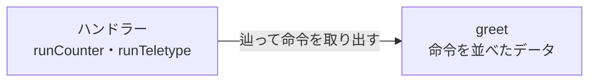

Eff モナドは、複数の効果を混ぜられるよう命令の型を型レベルのリストとして持ちます。モナド変換子でモナドを積み重ねていた役割を置き換えます。実装の変遷を反映して 2 通りの方式を説明します。

:::message
本記事の執筆には Claude Code (Opus 5) を利用しました。
:::

シリーズの記事です。

1. [Haskell 超入門](http://qiita.com/7shi/items/145f1234f8ec2af923ef)
1. [Haskell 代数的データ型 超入門](http://qiita.com/7shi/items/1ce76bde464b4a55c143)
1. [Haskell アクション 超入門](http://qiita.com/7shi/items/85afd7bbd5d6c4115ad6)
1. [Haskell ラムダ 超入門](http://qiita.com/7shi/items/1345bf32003faff435cb)
1. [Haskell アクションとラムダ 超入門](http://qiita.com/7shi/items/4a8a2807bb5186576c61)
1. [Haskell IOモナド 超入門](http://qiita.com/7shi/items/d3d3492ddd90d47160f2)
1. [Haskell リストモナド 超入門](http://qiita.com/7shi/items/deb19c4cba933590ffbf)
1. [Haskell Maybeモナド 超入門](http://qiita.com/7shi/items/c7d7eec066af0fe0688d)
1. [Haskell 状態系モナド 超入門](http://qiita.com/7shi/items/2e9bff5d88302de1a9e9)
1. [Haskell モナド変換子 超入門](http://qiita.com/7shi/items/4408b76624067c17e933)
1. [Haskell 例外処理 超入門](http://qiita.com/7shi/items/73e534c47bbebc71b37e)
1. [Haskell 構文解析 超入門](http://qiita.com/7shi/items/b8c741e78a96ea2c10fe)
1. [Haskell 継続モナド 超入門](https://zenn.dev/7shi/articles/20260803-haskell-continuation-monad)
1. [Haskell 型クラス 超入門](https://zenn.dev/7shi/articles/20260805-haskell-type-classes)
1. [Haskell モナドとゆかいな仲間たち](https://zenn.dev/7shi/articles/20260807-haskell-monads-and-friends)
1. [Haskell Freeモナド 超入門](https://zenn.dev/7shi/articles/20260808-haskell-free-monad)
1. [Haskell Operationalモナド 超入門](https://zenn.dev/7shi/articles/20260809-haskell-operational-monad)
1. **Haskell Effモナド 超入門** ← この記事
1. 【予定】Haskell アロー 超入門

# Free モナドから拡張可能な効果へ

前々回・前回は、命令を並べた手順書をデータとして組み立て、後からインタープリターで解釈するという枠組みを扱ってきました。Free モナドは継続を命令の型の中に持ち、Operational モナドは継続を `>>=` の側に持ちます。👉[Freeモナド](https://zenn.dev/7shi/articles/20260808-haskell-free-monad#命令の型) 👉[Operationalモナド](https://zenn.dev/7shi/articles/20260809-haskell-operational-monad#継続を命令の型から外す)

どちらも命令の型は 1 つでした。テレタイプの手順書にはテレタイプの命令しか置けません。

命令の型がまとまってひとかたまりの機能になったものを**効果**（effect）と呼びます。Free モナドの系譜は、当初から複数の効果を混ぜる方向へ発展してきており、行き着く先はモナド変換子が担ってきた役割の置き換えです。今回はその発展をたどります。

## 発展の系譜

この枠組みは、複数の命令の型を混ぜる方向へ発展してきました。👉[書誌](#参考)

|年|出来事|寄与|
|---|---|---|
|2008|Swierstra "Data types à la carte"|複数の命令の型を 1 つの型に合成する手法。この系譜の出発点|
|2010|Apfelmus "The Operational Monad Tutorial"|継続を `>>=` の側に持たせる方式（前回の主題）👉[Operationalモナド](https://zenn.dev/7shi/articles/20260809-haskell-operational-monad#参考)|
|2013|Kiselyov, Sabry, & Swords "Extensible Effects: An Alternative to Monad Transformers"|複数の効果を混ぜる枠組みとして体系化。土台は Free で、命令の型に `Functor` を要求していた|
|2015|Kiselyov & Ishii "Freer Monads, More Extensible Effects"|土台を Freer に差し替え。`Functor` インスタンスが不要になった|

2015 年の論文の題にある Freer は、前回の Operational と基本的に同じ方式を指す名前です。👉[Operationalモナド](https://zenn.dev/7shi/articles/20260809-haskell-operational-monad#継続を命令の型から外す)

`Program instr a` における `instr` を複数に拡張することで、拡張可能な効果（extensible effects）にたどり着きます。

## モナド変換子との関係

従来、別種のモナドを組み合わせる手段としては、モナド変換子が用いられてきました。👉[モナド変換子](https://qiita.com/7shi/items/4408b76624067c17e933#モナド変換子)

`State` と `IO` を一緒に使いたければ `StateT Int IO` のように型を積み、内側のアクションは `lift` で持ち上げます。積んだ型のことをモナドスタックと呼びました。👉[モナド変換子](https://qiita.com/7shi/items/4408b76624067c17e933#モナドスタック)

前々回・前回は「組み立てと解釈の分離」という観点で Free と Operational を見てきましたが、Free モナドから始まった発展の系譜は、モナドスタックの置き換えに向かっていたわけです。

# 複数の効果を混ぜる

ここからは実装に入り、複数の効果を混ぜるための仕組みを組み立てていきます。

## 型の異なる手順書

前回の `Program instr a` の `instr` は 1 つの型しか受け取れないため、複数の効果を混ぜることはできません。👉[Operationalモナド](https://zenn.dev/7shi/articles/20260809-haskell-operational-monad#継続を命令の型から外す)

前回のテレタイプ（`Teletype`）を使って確かめます。👉[Operationalモナド](https://zenn.dev/7shi/articles/20260809-haskell-operational-monad#まとめ)

これに加えて、通し番号を返す命令（`Counter`）を新たに用意します。命令は手順書を構成するデータなので、Counter 自体に副作用はありません。

```hs
data Teletype a where
    PutLine :: String -> Teletype ()
    GetLine ::           Teletype String

data Counter a where
    Tick :: Counter Int
```

`Teletype` と `Counter` は別々の命令の型です。実際に `Program Teletype` の手順書に `Counter` の命令 `Tick` を混ぜようとすると、型エラーになります。

```hs
greet :: Program Teletype ()
greet = do
    putLine "name?"
    name <- getLine'
    n <- tick         -- エラー: Tick は Teletype の命令ではない
    putLine ("Hello, " ++ name ++ "! " ++ show n)
```

`instr` が 1 つに固定されているのが原因なので、ここをリストにします。`Teletype` と `Counter` を両方使う手順書、と書けるようにするわけです。そのために、まず型のレベルでリストを扱う方法が必要になります。

## 型レベルのリスト

`[1, 2, 3]` は値のリストです。同じ書き方で `[Teletype, Counter]` のように型を並べたものを、型として扱えるようにするのが `DataKinds` という言語拡張です。

```hs:言語拡張
{-# LANGUAGE DataKinds #-}
```

型のレベルでリストを書くときは、値のリストと区別するために先頭にクォート `'` を付けます。

```hs
'[Teletype, Counter]
```

要素を 1 つ足すコンス演算子も、値の `:` に対して `':` になります。値のリストで `1 : [2, 3]` と書くのと同じ関係です。

```hs
Teletype ': '[Counter]  -- '[Teletype, Counter] と同じ
```

GHCi では `:set` で言語拡張を有効にできます。種を確認します。👉[Freeモナド](https://zenn.dev/7shi/articles/20260808-haskell-free-monad#種)

```text:GHCi
ghci> :set -XDataKinds
ghci> :k Teletype
Teletype :: * -> *
ghci> :k '[Teletype, Counter]
'[Teletype, Counter] :: [* -> *]
```

`Teletype` は型を 1 つ受け取って型になるので種が `* -> *` です。それを並べたリストの種は `[* -> *]` になります。角括弧が値のリストではなく種に付いている点が目印です。

:::message
`DataKinds` を有効にしないと、型の位置にリストを書いた時点でエラーになります。

```text:GHCi
ghci> :k '[Teletype, Counter]
Illegal type: ‘'[Teletype, Counter]’
  Perhaps you intended to use DataKinds
```

拡張の名前は「データ（値）を種に持ち上げる」という意味です。値のリストの書き方が、そのまま型のレベルで使えるようになります。
:::

今回はリストが書ければ十分なので、型レベルの計算には踏み込みません。

## 手順書に複数の命令を混ぜる

`Program instr a` における `instr` の型を、「リスト `es` のうちどれか 1 つの命令」を表す型に差し替えます。このような型を**オープンユニオン**（open union）と呼びます。ユニオンは和、オープンは要素を後から足せることを指します。

```hs
data Union es a where
    Here  :: e a -> Union (e ': es) a
    There :: Union es a -> Union (e ': es) a
```

GADT で書いています。前回と同じく、コンストラクターごとに戻り値の型を宣言する構文です。👉[Operationalモナド](https://zenn.dev/7shi/articles/20260809-haskell-operational-monad#命令の型を-gadt-で並べる)

- `Here` はリストの先頭の型 `e` の命令をそのまま包みます。
- `There` は先頭以外のどこかにある命令を包みます。中身は 1 つ短いリストのユニオンです。

`'[Teletype, Counter]` なら、`Tick :: Counter Int` は 2 番目なので `There (Here Tick)` になります。値としては、包んだ `There` の数が位置を表しています。

## 型クラスで位置を隠す

`There (Here Tick)` のように手で書くのは現実的ではありません。効果をリストのどこに置いたかを、使う側が数えることになるからです。位置の計算は型クラスに任せます。

```hs
class e :> es where
    inj :: e a -> Union es a
```

`class e :> es where` は中置（infix）のクラス宣言で、`class (:>) e es where` の糖衣構文です。`:>` がクラス名で、`e` と `es` が型変数にあたります。前回 `:>>=` のところで見たように、演算子を名前にするときは `:` で始める決まりがあります。👉[Operationalモナド](https://zenn.dev/7shi/articles/20260809-haskell-operational-monad#継続を命令の型から外す)

中置のクラス宣言には `TypeOperators`、型変数を 2 つ取るには `MultiParamTypeClasses` という拡張が要りますが、どちらも GHC2021 に含まれているのでプラグマは不要です。標準の型クラスは型変数 1 つに限られる、というのが後者の事情です。

`e :> es` は「効果 `e` がリスト `es` に含まれる」と読みます。`inj` は inject（注入）の略で、命令を然るべき位置に包む関数です。

インスタンスは 2 本です。先頭で見つかったらそこで止め、そうでなければ 1 つ潜って探し直します。リストに対する再帰と同じ形が、型クラスの解決として動きます。

```hs
instance {-# OVERLAPPING #-} e :> (e ': es) where
    inj = Here

instance {-# OVERLAPPABLE #-} e :> es => e :> (e' ': es) where
    inj = There . inj
```

`e :> (e ': es)` と `e :> (e' ': es)` は、`e'` が `e` と同じ場合に両方あてはまります。どちらを選ぶかをコンパイラが決められないので、そのままでは「Overlapping instances」というエラーになります。`{-# OVERLAPPING #-}` を付けた方を優先し、`{-# OVERLAPPABLE #-}` を付けた方は譲る、と指示することで、先頭を優先して選ばせています。

インスタンスの頭に `e ': es` のような具体的な型を書くことも標準では許されていないので、`FlexibleInstances` が要ります。これも GHC2021 に含まれます。

# Eff モナド

`Program` の `instr` を `Union es` に差し替えます。名前は effect に由来する `Eff` とします。

```hs
data Eff es a where
    Return :: a -> Eff es a
    (:>>=) :: Union es b -> (b -> Eff es a) -> Eff es a
```

前回の宣言と並べると、`Program`/`instr` を `Eff`/`es` に読み替えた名前の違いを除けば、変わったのは `instr` が `Union es` になった 1 か所だけです。

```hs
(:>>=) :: instr b    -> (b -> Program instr a) -> Program instr a  -- 前回
(:>>=) :: Union es b -> (b -> Eff es a)        -> Eff es a         -- 今回
```

3 段のインスタンスも前回のままです。👉[Operationalモナド](https://zenn.dev/7shi/articles/20260809-haskell-operational-monad#継続を命令の型から外す)

```hs
import Control.Monad (ap, liftM)

instance Functor (Eff es) where
    fmap = liftM

instance Applicative (Eff es) where
    pure = Return
    (<*>) = ap

instance Monad (Eff es) where
    Return a   >>= k = k a
    (u :>>= j) >>= k = u :>>= (\b -> j b >>= k)
```

前回 `singleton` だった関数は、`inj` で包む一手が増えて `send` になります。名前も、命令をエフェクトシステムへ送り出すという意味の `send` が慣例です。

```hs
send :: e :> es => e a -> Eff es a
send e = inj e :>>= Return
```

型に付いた `e :> es` が要点です。「`e` がリストのどこかにあれば使える」という書き方なので、位置も、リストの残りに何が入っているかも指定していません。

## 効果を 2 つ書く

命令の型は、さきほど書いた `Teletype` と `Counter` をそのまま使います。前回と同じ、GADT で戻り値の型を並べるだけの書き方です。手順書の側が変わっただけなので、命令の側は書き換えずに済みます。

スマートコンストラクターは `send` を使います。型には `:>` の制約だけを書きます。

```hs
putLine :: Teletype :> es => String -> Eff es ()
putLine s = send (PutLine s)

getLine' :: Teletype :> es => Eff es String
getLine' = send GetLine

tick :: Counter :> es => Eff es Int
tick = send Tick
```

これで手順書に両方の命令を置けます。使う効果を制約として並べるだけです。

```hs
greet :: (Teletype :> es, Counter :> es) => Eff es ()
greet = do
    putLine "name?"
    name <- getLine'
    n <- tick
    putLine ("Hello, " ++ name ++ "! " ++ show n)
```

`es` が具体的なリストではなく型変数のままである点に注目してください。`greet` は「テレタイプとカウンターが入っていればどんなリストでもよい」手順書です。`greet` 自身が使う効果を増やすなら制約の追加が要りますが、他の効果を使う手順書と組み合わせて `es` にその効果が加わるだけなら、`greet` の型はそのまま使えます。

## ハンドラー

インタープリター側を書きます。前回は手順書を最後まで解釈して結果を返す 1 つの関数でしたが、効果が複数ある今回はそうはいきません。全体の流れは、手順書を先頭から 1 コマンドずつ見て、自分が担当する効果ならその場で処理し、そうでなければ次のハンドラーへそのまま渡す、という中継です。効果を 1 つだけ取り除くインタープリターを**ハンドラー**（handler）と呼びます。

今回、`Teletype` は `IO` で文字列の入出力を処理します。他のハンドラー（`Counter`）は `Eff es a -> Eff es' a` という、`Eff` の世界に留まる型をしていますが、`IO` へ変換するハンドラーだけは `Eff ... a -> IO a` と、返す型が `Eff` ではなく `IO` です。一度 `IO` に変換してしまうと、そこから先は `Eff` を受け取るハンドラーに渡せなくなります。つまり、`IO` へ変換するハンドラーは常に一番外側（最後に適用するもの）になります。`Counter` はそれより手前に置いて「担当外なら次へ渡す」形のハンドラーになります。

まず、途中で素通しする方のハンドラーから見ます。型で見ると、リストの先頭の効果が消えます。

```hs
runCounter :: Int -> Eff (Counter ': es) a -> Eff es a
```

中身は、自分宛（`Here`）の命令を処理し、他人宛（`There`）はそのまま素通しします。

```hs
runCounter _ (Return a) = Return a
runCounter n (u :>>= k) = case u of
    Here Tick -> runCounter (n + 1) (k n)
    There u'  -> u' :>>= (runCounter n . k)
```

`Here Tick` の枝では、現在の値 `n` を継続 `k` に渡し、カウンターを 1 つ進めて先へ進みます。`There u'` の枝では、`u'` が 1 つ短いリストのユニオンになっているので、それを `:>>=` で組み直して手順書として返します。素通しした命令は、後から適用される別のハンドラーが受け取ります。

`n` を引数として持ち回り、更新した値を次の再帰呼び出しに渡すこの形は、`State` モナドが「現在の状態を受け取り、更新した状態を次に渡す」のと同じ動きです。`Counter` 専用の状態を、`runCounter` が手作業の再帰で持ち回っている、と見ることができます。

テレタイプの方は、途中で素通しするのではなく、本物の `IO` で処理して鎖を終わらせる方です。リストが `'[Teletype]` だけになった状態、つまり上で触れたとおり最後に適用するハンドラー専用の型になります。

```hs
runTeletype :: Eff '[Teletype] a -> IO a
runTeletype (Return a) = return a
runTeletype (u :>>= k) = case u of
    Here (PutLine s) -> putStrLn s >> runTeletype (k ())
    Here GetLine     -> getLine >>= runTeletype . k
    There u'         -> case u' of {}
```

最後の行は見慣れない書き方です。`There u'` の `u'` は `Union '[] a` ですが、`Here` も `There` も空でないリストを要求するので、この型の値は作れません。値が存在しない型に対する `case` は、枝を 1 つも書かずに `case u' of {}` と書けます。

:::message
枝が空の `case` は `EmptyCase` という拡張ですが、これは GHC2021 に含まれているので、プラグマを書かなくてもそのまま使えます。
:::

「ここには来ない」と `error` で書く代わりに、来ないことを型で示した形です。

:::message
`There u' -> error "unreachable"` と書いても型は通り、実際に来ない以上は動作も変わりません。`error :: String -> a` も、どんな型 `a` にもなれる式だからです。ただし、これは「来ないはずだ」というプログラマーの主張を GHC がそのまま信じているだけで、検証はされていません。将来コードを書き換えてこの枝に実際に来るようになっても、コンパイルは通ったまま、実行時に初めて失敗します。`case u' of {}` は、`u'` の型に値が存在しないことを GHC 自身が確認した上で枝 0 個を認めているので、そもそもこの枝に来る値を作ることが型として不可能です。「来ないと信じて実行時に賭ける」書き方と「来られないことを型で証明する」書き方の違いです。
:::

2 つのハンドラーに共通するのは、手順書を辿るのがハンドラーの側だという点です。`greet` は命令を並べただけのデータで、それ自体は何もしません。



矢印は駆動する向き、つまり呼ぶ側から呼ばれる側へ引いてあります。

:::message
後で別の実装を見るときに、この向きが逆転します。
:::

## 動かす

ハンドラーを内側から順に適用します。

```hs
main = runTeletype (runCounter 0 greet)
```
```text:実行結果（標準入力: alice）
name?
Hello, alice! 0
```

`greet` の型は `(Teletype :> es, Counter :> es) => Eff es ()` でした。`runCounter 0 greet` と書いた時点で `es` が `Counter ': es'` に決まり、続けて `runTeletype` を適用したことで `es'` が `'[]` に決まります。結果として `es` は `'[Counter, Teletype]` です。手順書の側にリストを書かなくても、適用したハンドラーの並びから決まります。

必要な言語拡張をまとめておきます。GHC2021 に含まれないのはこの 2 つだけで、`GADTs` は前回導入したので、新しく増えるのは `DataKinds` です。

```hs
{-# LANGUAGE GADTs #-}
{-# LANGUAGE DataKinds #-}
```

:::message
GHC2021 ではなく Haskell2010 で動かす場合は、上の 2 つに加えて `TypeOperators`・`MultiParamTypeClasses`・`FlexibleInstances`・`FlexibleContexts`・`EmptyCase` も必要です。
:::

## 練習

【問1】3 つ目の効果として、文字列を記録する `Logger` を足してください。命令は `Log` の 1 つで、記録した文字列をリストで集めるハンドラー `runLogger` を書きます。ハンドラーが結果の型を変えている点が `runCounter` と違います。

```hs
data Logger a where
    Log :: String -> Logger ()

logMsg :: Logger :> es => String -> Eff es ()
logMsg = undefined     -- ここを書く

runLogger :: Eff (Logger ': es) a -> Eff es (a, [String])
runLogger = undefined  -- ここを書く

greet :: (Teletype :> es, Counter :> es, Logger :> es) => Eff es ()
greet = do
    putLine "name?"
    name <- getLine'
    logMsg ("got " ++ name)
    n <- tick
    logMsg ("tick " ++ show n)
    putLine ("Hello, " ++ name ++ "! " ++ show n)

main = do
    ((), logs) <- runTeletype (runCounter 0 (runLogger greet))
    mapM_ putStrLn logs
```
```text:実行結果（標準入力: alice）
name?
Hello, alice! 0
got alice
tick 0
```

:::details 解答例
```hs
logMsg :: Logger :> es => String -> Eff es ()
logMsg s = send (Log s)

runLogger :: Eff (Logger ': es) a -> Eff es (a, [String])
runLogger (Return a) = Return (a, [])
runLogger (u :>>= k) = case u of
    Here (Log s) -> do
        (a, ls) <- runLogger (k ())
        return (a, s : ls)
    There u'     -> u' :>>= (runLogger . k)
```

`Here (Log s)` の枝では、継続を `k ()` として先に処理してから、その結果のリストの先頭に `s` を足しています。素通しの `There u'` の枝は `runCounter` とまったく同じ形です。

`greet` の宣言に足したのは `Logger :> es` という制約 1 つだけで、既に書いてある `putLine` や `tick` には手を入れていません。効果を足すのがリストへの追加で済む、というのがこの形の効きどころです。
:::

# Eff の別実装

ここまでは、手順書が命令の型を複数受け付けられるように拡張してきました。どの効果の命令かは `Here`・`There` の重なりとして値の中に持ち、ハンドラーは自分宛の命令だけを処理して、残りは素通しします。命令はデータとして組み立てられ、ハンドラーがそれを辿ります。Free モナドから続く系譜の延長で、そこに効果のリストを載せたものが `Eff` でした。

後で紹介する `effectful` パッケージの `Eff` は、この形をしていません。中身はデータではなく関数です。手順書の書き方は変わりませんが、それはデータとして組み上がるのではなく、ハンドラーを呼ぶ処理そのものになります。書き換わるのはハンドラーの中身と、それを呼び出す仕組みです。エフェクトシステムのライブラリはこの中身の違いで系統が分かれます。

この形の `Eff` を書いて動かしてみます。骨格をたどるための簡略化版で、`effectful` そのものではありません。実際のパッケージとの違いは、後で使うときに触れます。

## Eff の中身を関数にする

`Eff` の中身を、データではなく関数にします。受け取るのは、効果のリストと同じ長さのハンドラーの列です。これを**環境**と呼び、`Env` という型で表します。

```hs
newtype Eff es a = Eff { unEff :: Env es -> IO a }

data Env es where
    ENil  :: Env '[]
    ECons :: (forall x. e x -> IO x) -> Env es -> Env (e ': es)
```

`Env es` が、リストの各効果に対応するハンドラーを並べたものです。`ECons` の第 1 引数がハンドラー 1 つで、命令を受け取って `IO` を返す関数になっています。

`forall x.` が付いているのは、1 つのハンドラーが `PutLine :: Teletype ()` と `GetLine :: Teletype String` の両方に使えなければならないからです。前回 `interpretWithMonad` の型で出てきたのと同じ事情です。👉[Operationalモナド](https://zenn.dev/7shi/articles/20260809-haskell-operational-monad#operational-パッケージ)

:::message
これまで `forall` は `runST` や `interpretWithMonad` のように、ライブラリ側の型に付いているものを使うだけでした。その場合は拡張が要りません。今回は初めて自分で書く側に回ります。引数や `data` のフィールドに `forall` を書くには `RankNTypes` という拡張が要りますが、GHC2021 に含まれているのでプラグマは不要です。Haskell2010 では明示的に有効にします。
:::

前回までの `Eff` は `Return a` と `u :>>= k` というデータ構造で、3 段のインスタンスは `Return`・`:>>=` を辿るだけの定型的な実装で済みました。今回の `Eff` は `Env es -> IO a` という関数を `newtype` で包んだだけなので、同じことはできません。`fmap`・`pure`・`<*>`・`>>=` はどれも「関数を受け取って関数を返す」形で書き直す必要があります。

```hs
instance Functor (Eff es) where
    fmap f (Eff m) = Eff $ fmap f . m

instance Applicative (Eff es) where
    pure = Eff . const . pure
    Eff f <*> Eff x = Eff $ \env -> f env <*> x env

instance Monad (Eff es) where
    Eff m >>= k = Eff $ \env -> m env >>= \a -> unEff (k a) env
```

`m env`・`f env`・`x env` はどれも `IO a` の形をしています。右辺に出てくる `fmap`・`pure`・`<*>`・`>>=` は、この `IO` の値に対して働くものなので、`Eff` のものではなく `IO` のインスタンスが呼ばれます。

`fmap f (Eff m) = Eff $ fmap f . m` は、`env` を渡した形で追うと `Eff (\env -> fmap f (m env))` になります。`env` を `m` に渡して `IO a` を取り出し、`f` を作用させます。

`pure` は、`x` を渡した形で書けば `pure x = Eff (const (pure x))`、つまり `Eff (\env -> pure x)` になります。`const` で `env` を捨てているとおり、`env` を一切見ずに `pure x` を返すだけの関数です。

`Eff f <*> Eff x = Eff $ \env -> f env <*> x env` は、同じ `env` を `f` と `x` の両方に渡して、それぞれから得た `IO (a -> b)` と `IO a` を組み合わせています。

`>>=` も同様に、`env` を両側に渡しています。`m env` で先に `IO a` を実行し、その結果 `a` を `k` に渡して次の `Eff es b` を取り出し、そこに同じ `env` をもう一度渡して `unEff` で中身の関数を呼び出しています。

前の実装では、`>>=` は `Union` の中身をパターンマッチしてハンドラーの枝を選んでいます。今回はその役目がなく、`IO` の `>>=` に任せています。命令をどう解釈するかは、次に見る `send` と `handler` の側に移っています。

## 環境からハンドラーを取り出す

`:>` は同じ名前・同じ役割ですが、メソッドが変わります。位置を数えて `Union` を作る代わりに、環境から該当するハンドラーを取り出します。インスタンスの構造は前と同じです。

```hs
class e :> es where
    handler :: Env es -> (forall x. e x -> IO x)

instance {-# OVERLAPPING #-} e :> (e ': es) where
    handler (ECons h _) = h

instance {-# OVERLAPPABLE #-} e :> es => e :> (e' ': es) where
    handler (ECons _ r) = handler r
```

`e :> es` は「`es` の何番目に `e` があるか」を求める仕組みです。`OVERLAPPING` インスタンスは先頭が `e` に一致する場合、`OVERLAPPABLE` インスタンスは一致しない場合に選ばれ、`es` を 1 つ短くして同じ探索を再帰的に繰り返します。これは型レベルの線形探索ですが、実行時のループではなく、コンパイル時の型クラス解決によって行われます。`e` が `es` の何番目かは型検査の段階で確定し、実行時には確定した段数だけ `ECons _ r` を剥がして `Env` を辿るだけです。前回の `Union` の `Here`/`There` は位置を実行時のデータとして持ち歩いていましたが、こちらは位置の計算そのものをコンパイル時に済ませています。

`send` の型は前の実装と同じですが、中身はシンプルです。

```hs
send :: e :> es => e a -> Eff es a
send op = Eff $ \env -> handler env op
```

命令をデータにせず、その場でハンドラーを引いて実行します。ここで呼び出しの向きが逆転しています。前の実装では、`greet` は命令を並べただけのデータで、それ自体は何もしませんでした。実行を駆動するのはハンドラーの側で、手順書を辿りながら命令を取り出して処理していました。この実装の `greet` は、`send` がハンドラーを引いて呼ぶ処理そのものです。ハンドラーは環境に置かれて待っているだけで、自分から辿ることはありません。


前の実装の図と見比べると、矢印の向きが逆になっています。呼ぶ側と呼ばれる側が入れ替わったわけです。

この向きの逆転が、残りの部品の形を決めます。前の実装の `runTeletype`・`runCounter` は、`u :>>= k` をパターンマッチして、先頭の効果なら命令を処理し、そうでなければ素通しし、いずれも継続 `k` を適用した結果に自分自身を呼び直す、という形でした。ディスパッチ・命令の処理・継続の処理が、1 つの関数に同居していたわけです。

この実装では、そのうち命令の処理だけが残ります。ハンドラーは `send` が環境から取り出す形となり、後続の処理は `Monad` インスタンスが `IO` の `>>=` に任せています。辿るべきデータもないので、自分自身を呼び直す必要もありません。残った「1 つの命令を処理する関数」を受け取って環境に積む、という配線だけを `interpret` にまとめます。

```hs
interpret :: (forall x. e x -> Eff es x) -> Eff (e ': es) a -> Eff es a
interpret f (Eff m) = Eff $ \env -> m (ECons (\op -> unEff (f op) env) env)
```

`Eff (e ': es) a` を受け取って `Eff es a` を返す、という型は前の実装のハンドラーと同じです。中身は、渡された `f` を `ECons` で環境に積み、内側の `Eff` にその環境を渡して走らせるだけです。積んだ `f` を実際に呼ぶのは `send`（`handler env op`）の役目なので、繰り返し呼び出しはここには現れません。

効果ごとのハンドラーは、`interpret` に命令の処理を渡すだけで書けます。実際の `runTeletype`・`runCounter` は、効果の定義を確認したあとで書きます。

ここで、前の実装にはなかった関数を追加します。前の実装では、最後に適用する `runTeletype` だけが `Eff '[Teletype] a -> IO a` という特別な型で、自分で `IO` へ変換して鎖を終わらせていました。それに対して、この実装のハンドラーは `interpret` で書く以上、どれも `Eff (e ': es) a -> Eff es a` という同じ型です。効果を全部剥がしても `Eff '[] a` が残り、これは環境を待っている関数のままで、`IO` にはなりません。

そこで、最後に走らせる関数を別に用意します。環境が空なので `ENil` を渡すだけです。

```hs
run :: Eff '[] a -> IO a
run (Eff m) = m ENil
```

これで一通り揃ったので、実行の流れを整理します。`run (interpret f1 (interpret f2 ...))` のように書いたとき、まず外側から `interpret` が順に呼ばれて、`f1`・`f2` が `ECons` で環境に積まれます。`run` が `ENil` を渡すと、積み上がった環境が内側の `Eff` に届いて `IO` が走り出します。ここまでが 1 回きりの準備です。

走り出した後は、`>>=` が `IO` として本体を順に進めていき、`send` に行き当たるたびに `handler env op` で環境からハンドラーを引いて呼び出します。積む段階は 1 回、積まれた関数が呼ばれるのは命令のたび、という 2 段階になっています。

## 効果とハンドラーの実装

効果の定義とスマートコンストラクターは同じです。`greet` もそのままです。

```hs
data Teletype a where
    PutLine :: String -> Teletype ()
    GetLine ::           Teletype String

data Counter a where
    Tick :: Counter Int

putLine :: Teletype :> es => String -> Eff es ()
putLine s = send (PutLine s)

getLine' :: Teletype :> es => Eff es String
getLine' = send GetLine

tick :: Counter :> es => Eff es Int
tick = send Tick

greet :: (Teletype :> es, Counter :> es) => Eff es ()
greet = do
    putLine "name?"
    name <- getLine'
    n <- tick
    putLine ("Hello, " ++ name ++ "! " ++ show n)
```

ハンドラーは `interpret` で書きます。渡すのは「1 つの命令を処理する関数」なので、書くことは命令ごとの場合分けだけです。テレタイプは命令を `IO` に写すだけで済みます。

```hs
runTeletype :: Eff (Teletype ': es) a -> Eff es a
runTeletype = interpret $ \op -> Eff $ \_ -> case op of
    PutLine s -> putStrLn s
    GetLine   -> getLine
```

`\op -> ...` が命令 1 つを処理する関数です。戻り値は `Eff es x` なので、`IO` の処理を `Eff $ \_ -> ...` で包みます。この関数は環境を使わないため `\_` で捨てています。`runTeletype` はこれを `interpret` に渡すだけで、引数 `Eff (Teletype ': es) a` は `interpret` が受け取るので書いていません。

テレタイプのように命令を `IO` に写すだけなら、これで済みます。それに対してカウンターのように状態を持つ場合は、もう一工夫が必要になります。

カウンターの状態は、`interpret` に渡す関数（命令を処理する関数）の中に置くことはできません。その関数は命令のたびに呼ばれるので、中で作った値は毎回作り直しになってしまいます。そこで、ハンドラーを積むのは 1 回きりという仕様に基づいて、`interpret` の外側で `IORef` を作ってキャプチャします。👉[状態系モナド](https://qiita.com/7shi/items/2e9bff5d88302de1a9e9#破壊的代入)

```hs
import Data.IORef

runCounter :: Int -> Eff (Counter ': es) a -> Eff es a
runCounter n0 m = do
    r <- Eff $ \_ -> newIORef n0
    interpret (\Tick -> Eff $ \_ -> do
        n <- readIORef r
        writeIORef r (n + 1)
        return n) m
```

`interpret` を呼ぶ前に `IORef` を作り、それを使う関数を `interpret` に渡しています。`IORef` が作られるのは 1 回だけで、命令のたびに呼ばれる関数はその同じ `IORef` を読み書きします。これで、独立に呼ばれる関数どうしが状態を共有できます。全体は `Eff es` の `do` なので、`newIORef` も `Eff $ \_ -> ...` で包む必要があります。`Counter` の命令は `Tick` 1 つだけなので、命令を処理する関数の方は `\Tick -> ...` と場合分けなしで直接パターンマッチしています。`interpret` に処理する対象 `m` を明示的に渡している点だけ、`runTeletype` と形が違います。

ハンドラーを両方適用した後、`run` で走らせます。

```hs
main = run (runTeletype (runCounter 0 greet))
```
```text:実行結果（標準入力: alice）
name?
Hello, alice! 0
```

前の実装と 1 文字も違わない出力です。

## 何が変わったのか

2 つの実装を並べます。

| |手順書（オープンユニオン）|環境（ハンドラーの列）|
|---|---|---|
|`Eff es a` の中身|`Return`／`:>>=` のデータ|`Env es -> IO a` の関数|
|`send`|命令をデータとして置く|環境からハンドラーを取り出して即実行|
|ハンドラー|データを辿って剥がす|環境にハンドラーを 1 つ積む|
|`greet`|命令を並べただけの DSL|ハンドラーを呼ぶ処理そのもの|
|実行を駆動するもの|ハンドラー（辿る側）|`greet` の中の `send`|
|状態の持ち方|辿る関数の引数|`IORef`|
|最後に走らせる|`runTeletype` が兼ねる|`run` を別途用意する|

`Eff es a`・`e :> es`・`send` という表向きの顔は変わっていません。効果の定義も、スマートコンストラクターも、`greet` も共通です。書き直したのはハンドラーから先で、命令を辿る再帰は `interpret` へ、`IO` に抜ける役目は `run` へ移りました。

大きく変わったのは、組み立てと解釈が分離していないことです。Free/Operational モナドで見た「手順書をデータとして組み立て、後から解釈する」という枠組みが、この実装には残っていません。命令を置くだけだった `send` がその場でハンドラーを呼ぶようになり、`greet` は何もしないデータからハンドラーを呼ぶ処理そのものへ変わりました。同じ `do` 記法で同じように書けて、型も `Eff es ()` のままですが、中身が入れ替わっています。分離は、`Eff` という型と `interpret` という関数の形として残ってはいますが、データ構造としては消えました。

そのため、同じ手順書を複数のインタープリターで使い回すという Free モナドの利点は、こちらでは形を変えます。手順書が残らないので、使い回すのは「効果に対して多相な関数」の方です。`greet` の型が `(Teletype :> es, Counter :> es) => Eff es ()` と `es` について多相なので、どんなハンドラーの組み合わせにも渡せます。本番用と、テスト用のモックと、ログ収集用のハンドラーを差し替える、という使い方はそのまま成立します。

`run` の型が `Eff '[] a -> IO a` で、効果を全部剥がしても `IO` が残るのは、この実装が `IO` の上に載っているからです。

この 2 つ目の実装が、次に紹介する effectful パッケージの骨格になっています。

## 練習

【問2】問1の `Logger` を、この実装で書き直してください。効果の定義とスマートコンストラクターはそのまま使えます。`interpret` で書くハンドラーは `Eff (e ': es) a -> Eff es a` の形にしかならないので、結果の型を変える `runLogger` は `runCounter` と同じ方法を使います。

```hs
data Logger a where
    Log :: String -> Logger ()

logMsg :: Logger :> es => String -> Eff es ()
logMsg = undefined     -- ここを書く

runLogger :: Eff (Logger ': es) a -> Eff es (a, [String])
runLogger = undefined  -- ここを書く

greet :: (Teletype :> es, Counter :> es, Logger :> es) => Eff es ()
greet = do
    putLine "name?"
    name <- getLine'
    logMsg ("got " ++ name)
    n <- tick
    logMsg ("tick " ++ show n)
    putLine ("Hello, " ++ name ++ "! " ++ show n)

main = do
    ((), logs) <- run (runTeletype (runCounter 0 (runLogger greet)))
    mapM_ putStrLn logs
```
```text:実行結果（標準入力: alice）
name?
Hello, alice! 0
got alice
tick 0
```

記録は `runCounter` と同じく `IORef` に溜めます。`interpret` が返すのは `Eff es a` なので、`[String]` は `interpret` を適用した後で `IORef` から読み出して組にします。

:::details 解答例
```hs
logMsg :: Logger :> es => String -> Eff es ()
logMsg s = send (Log s)

runLogger :: Eff (Logger ': es) a -> Eff es (a, [String])
runLogger m = do
    r <- Eff $ \_ -> newIORef []
    a <- interpret (\(Log s) -> Eff $ \_ -> modifyIORef r (s :)) m
    ls <- Eff $ \_ -> readIORef r
    return (a, reverse ls)
```

`logMsg` は問1と同じです。書き換わるのは `runLogger` だけで、記録を溜める `IORef` を `interpret` の外で作り、命令のたびに呼ばれる関数がそこへ書き足します。状態を持つハンドラーという点で `runCounter` と同じ形です。

結果の型が違う分だけ、`runCounter` より 1 手増えます。`interpret` が返すのは `Eff es a` で `[String]` を含められないので、`interpret` を適用した後で `IORef` を読み出し、`(a, [String])` に組み直しています。`modifyIORef r (s :)` は先頭に足しているので、最後に `reverse` します。

問1では、手順書を辿りながら継続の結果にリストを継ぎ足していました。辿るデータが無いこちらでは、ハンドラーが溜めた結果を後から回収する形になります。
:::

# effectful パッケージ

`Eff` モナドを提供する代表的な実装として、[effectful](https://hackage.haskell.org/package/effectful) パッケージを使います。名前のとおり効果を扱うライブラリで、[`Effectful`](https://hackage.haskell.org/package/effectful-core/docs/Effectful.html) モジュールが入口です。

:::message
`effectful` は GHC に同梱されていないため、実行には導入が必要です。[Stack](https://docs.haskellstack.org/) を使う場合は次のように起動できます。

```
stack script --resolver lts-24.53 --package effectful ファイル名.hs
```
:::

`Eff` の型は次のように定義されています。

```hs
newtype Eff (es :: [Effect]) a = Eff (Env es -> IO a)
```

前節で自作したものと同じ形です。`Env` の中身は効率のために可変配列になっていますが、「効果のリストと同じ長さのハンドラーの列を受け取る関数」という骨格は変わりません。

効果は自作するだけでなく、`State`・`Writer`・`Reader`・`Error` といったおなじみの顔ぶれが最初から用意されています。`get`・`put`・`modify`・`tell`・`ask` といった関数の名前も同じなので、書き味はほとんど変わりません。👉[状態系モナド](https://qiita.com/7shi/items/2e9bff5d88302de1a9e9#状態系モナド)

既製の効果はモジュール名が分岐しています。`State` なら `Effectful.State.Static.Local`・`Effectful.State.Static.Shared`・`Effectful.State.Dynamic` があり、状態をスレッドごとに持つか共有するか、ハンドラーを差し替え可能にするかで選びます。

:::message
これらは `mtl` の `State`・`Writer` をそのまま持ち込んだものではなく、`Eff` の効果として定義し直した互換の実装です。名前と使い勝手を揃えてあるだけで、`Effectful.State.Static.Local` などの `State` は `Control.Monad.State` の `StateT` とは別の型です。関数名も重なるので、両方を `import` すると衝突します。

`Control.Monad.State` の `modify` を `Eff` の中でそのまま使うこともできません。`mtl` のクラス（`MonadState` など）に合わせるための仕組みは別に用意されていますが、本記事では使用しません。
:::

本記事では `Effectful.*.Static.Local` を使います。`Static` は解釈が固定されていることを、`Local` はスレッドローカルであることを表します。

## 効果を定義する

自作してきた `Teletype` を、`effectful` の効果に直します。足すのは 2 点だけです。

```hs
data Teletype :: Effect where
    PutLine :: String -> Teletype m ()
    GetLine ::           Teletype m String

type instance DispatchOf Teletype = Dynamic
```

1 点目は、命令の型に `m` という引数が増えたことです。効果の種は `Effect` という別名になっていて、中身は次のとおりです。

```hs
type Effect = (Type -> Type) -> Type -> Type
```

自作版の効果は `Type -> Type`（つまり `* -> *`）でしたが、こちらは引数が 1 つ多くなっています。

:::message
`m` は**高階効果**（higher-order effect）のための引数です。ハンドラーが `Eff` の計算そのものを受け取る効果、たとえば例外を捕まえる `catch` や、環境を局所的に書き換える `local` がこれにあたります。今回のように命令が値だけを受け取る効果では使わないので、`m` はどこにも現れません。
:::

2 点目は、その効果をどう解釈するかの宣言です。`Dynamic` は「ハンドラーを実行時に選ぶ」、つまり自作版と同じく後から与える方式を指します。`Effectful.Dispatch.Dynamic` モジュールを `import` すると使えます。

スマートコンストラクターは `send` です。名前も型も自作版と同じで、効果を要求する制約が `:>` で書けるところまで一致しています。

```hs
putLine :: Teletype :> es => String -> Eff es ()
putLine = send . PutLine

getLine' :: Teletype :> es => Eff es String
getLine' = send GetLine
```

ハンドラーは `interpret_` で作ります。自作版の `interpret` と同じ位置づけです。

```hs
runTeletypeIO :: IOE :> es => Eff (Teletype : es) a -> Eff es a
runTeletypeIO = interpret_ $ \op -> case op of
    PutLine s -> liftIO $ putStrLn s
    GetLine   -> liftIO getLine
```

`IOE` は `IO` を使えることを表す効果です。`liftIO` で `IO` アクションを持ち上げるところは、モナド変換子のときと同じ書き方になります。👉[モナド変換子](https://qiita.com/7shi/items/4408b76624067c17e933#liftio)

:::message
`interpret_` の末尾のアンダースコアは、高階効果向けの引数を省いた版であることを表します。`interpret` の方はハンドラーの第 1 引数に `LocalEnv` を取りますが、今回のような効果では使わないので `interpret_` が便利です。
:::

## 状態を持つ効果

カウンターも同じ手順で定義できます。命令が 1 つだけなので、書くことはさらに少なくなります。

```hs
data Counter :: Effect where
    Tick :: Counter m Int

type instance DispatchOf Counter = Dynamic

tick :: Counter :> es => Eff es Int
tick = send Tick
```

ハンドラーには状態が必要です。自作版では `IORef` を手で用意しましたが、ここでは既製の `State` 効果に預けます。使うのは `reinterpret_` で、剥がした効果を別の効果で実装するための関数です。

```hs
runCounter :: Int -> Eff (Counter : es) a -> Eff es a
runCounter n0 = reinterpret_ (evalState n0) $ \Tick -> do
    n <- get
    put (n + 1)
    return n
```

`evalState n0` が、`Counter` を剥がした先で `State Int` を処理するハンドラーです。カウンターの状態はここに預けてあるので、命令の処理は `get`・`put` を呼ぶだけで済みます。`Counter` の命令は `Tick` 1 つだけなので、`\Tick -> ...` と場合分けなしで直接パターンマッチしています。

`IO` を使わないため、`runTeletypeIO` と違って `IOE` の制約は付きません。カウンターは `IO` の要らない手順書にも混ぜられます。

:::message
`n <- get` と書いたとき、`n` の型が決まらないことがあります。`get` の型は `State s :> es => Eff es s` で、`s` はリスト `es` から一意には決まりません。上の `runCounter` では `evalState n0` の `n0 :: Int` から決まりますが、そうでなければ使う側で注釈が要ります。
:::

## 全体を動かす

`greet` は自作版のまま書けます。ハンドラーを両方適用して `runEff` で走らせます。

```hs
{-# LANGUAGE DataKinds #-}
{-# LANGUAGE GADTs #-}
{-# LANGUAGE TypeFamilies #-}
import Effectful
import Effectful.Dispatch.Dynamic
import Effectful.State.Static.Local

data Teletype :: Effect where
    PutLine :: String -> Teletype m ()
    GetLine ::           Teletype m String

data Counter :: Effect where
    Tick :: Counter m Int

type instance DispatchOf Teletype = Dynamic
type instance DispatchOf Counter  = Dynamic

putLine :: Teletype :> es => String -> Eff es ()
putLine = send . PutLine

getLine' :: Teletype :> es => Eff es String
getLine' = send GetLine

tick :: Counter :> es => Eff es Int
tick = send Tick

runTeletypeIO :: IOE :> es => Eff (Teletype : es) a -> Eff es a
runTeletypeIO = interpret_ $ \op -> case op of
    PutLine s -> liftIO $ putStrLn s
    GetLine   -> liftIO getLine

runCounter :: Int -> Eff (Counter : es) a -> Eff es a
runCounter n0 = reinterpret_ (evalState n0) $ \Tick -> do
    n <- get
    put (n + 1)
    return n

greet :: (Teletype :> es, Counter :> es) => Eff es ()
greet = do
    putLine "name?"
    name <- getLine'
    n <- tick
    putLine ("Hello, " ++ name ++ "! " ++ show n)

main :: IO ()
main = runEff $ runTeletypeIO $ runCounter 0 greet
```
```text:実行結果（標準入力: alice）
name?
Hello, alice! 0
```

自作した 2 つの実装と同じ出力です。効果の定義・スマートコンストラクター・`greet` のどれもが、`m` 引数とディスパッチの宣言を足しただけで、ほぼそのまま移ります。ハンドラーだけは `State` に預ける形に変わりましたが、`greet` の型は `(Teletype :> es, Counter :> es) => Eff es ()` のままです。状態をどう持つかはハンドラーの中の話なので、手順書の側は書き換えずに済みます。

`type instance` を書くので `TypeFamilies` が必要です。型レベルのリストは `DataKinds` のままです。なお `Eff (Teletype : es)` のようにリストの途中では、クォートを省いても型として解釈されるので `':` と書かなくても通ります。

最後に走らせる関数は 2 つあります。

```hs
runEff     :: Eff '[IOE] a -> IO a
runPureEff :: Eff '[] a -> a
```

`IO` を使う手順書は `runEff` で、使わない手順書は `runPureEff` で走らせます。自作版の `run` が `Eff '[] a -> IO a` だったのに対し、`runPureEff` は `IO` が付かない点が違います。

:::message
実装では `Eff es a` の中身が `IO` を使う関数になっており、`runPureEff` は内部で `unsafeDupablePerformIO` によって `IO` を剥がしています。効果リストが空であることが「`IO` を副作用として使っていない」保証になるため、この操作でも安全に純粋な値として取り出せます。
:::

## 簡略化版との違い

自作した簡略化版とパッケージの違いを整理します。`Eff es a`・`e :> es`・`send`・ハンドラーで効果を 1 つずつ剥がすという骨格は共通で、違うのは作り込みの部分です。

|項目|簡略化版|`effectful`|
|---|---|---|
|環境|`ENil`・`ECons` のリスト|可変配列|
|効果の種|`* -> *`|`Effect`（`m` 引数が増える）|
|ディスパッチ|後から与える一択|`DispatchOf` で `Dynamic`・`Static` を選ぶ|
|ハンドラー|`interpret`|`interpret_`（高階効果には `interpret`）|
|走らせる|`run :: Eff '[] a -> IO a`|`runEff`・`runPureEff`|
|効果|自作のみ|`State`・`Writer`・`Reader`・`Error` などが付属|

高階効果はハンドラーが `Eff` の計算そのものを受け取る効果で、`m` 引数と `interpret` の `LocalEnv` はそのために用意されています。簡略化版が省いたのは主にこの部分です。効果を自作して使う分には、ここまで見てきたとおり簡略化版と同じ感覚で書けます。

## 練習

【問3】問1・問2と同じ `Logger` を `effectful` で実装してください。カウンターの状態を `State` に預けたのと同じように、記録は既製の `Writer` 効果に預けられます。`Effectful.Writer.Static.Local` の `tell` と `runWriter` を使います。

```hs
data Logger :: Effect where
    Log :: String -> Logger m ()

type instance DispatchOf Logger = Dynamic

logMsg :: Logger :> es => String -> Eff es ()
logMsg = undefined     -- ここを書く

runLogger :: Eff (Logger : es) a -> Eff es (a, [String])
runLogger = undefined  -- ここを書く

greet :: (Teletype :> es, Counter :> es, Logger :> es) => Eff es ()
greet = do
    putLine "name?"
    name <- getLine'
    logMsg ("got " ++ name)
    n <- tick
    logMsg ("tick " ++ show n)
    putLine ("Hello, " ++ name ++ "! " ++ show n)

main :: IO ()
main = do
    ((), logs) <- runEff $ runTeletypeIO $ runCounter 0 $ runLogger greet
    mapM_ putStrLn logs
```
```text:実行結果（標準入力: alice）
name?
Hello, alice! 0
got alice
tick 0
```

:::details 解答例
```hs
logMsg :: Logger :> es => String -> Eff es ()
logMsg = send . Log

runLogger :: Eff (Logger : es) a -> Eff es (a, [String])
runLogger = reinterpret_ runWriter $ \(Log s) -> tell [s]
```

`runCounter` と同じ形です。`reinterpret_` の第 1 引数を `evalState n0` から `runWriter` に替え、命令の処理を `tell` にしただけです。

`runWriter` の型は `Eff (Writer w : es) a -> Eff es (a, w)` で、結果に `w` が付きます。`reinterpret_` はこれをそのまま `runLogger` の結果にするので、自作版で `IORef` に溜めて後から読み出した部分が丸ごと不要になります。`w` が `[String]` であることは `runLogger` の型から決まります。
:::

# モナド変換子との比較

冒頭で触れたとおり、この枠組みはモナド変換子と比較される形で発展してきました。実際に書き比べます。

素材はモナド変換子の回の冒頭に出てきたもので、リストを畳んで合計します。効果を 3 つに増やして、しきい値を `Reader` で受け取り、合計を `State` に持ち、しきい値を超えた合計だけを `Writer` に記録します。

```hs
import Control.Monad
import Control.Monad.Reader
import Control.Monad.State
import Control.Monad.Writer

sum' :: Int -> [Int] -> (Int, [Int])
sum' limit xs = runWriter $ (`runReaderT` limit) $ (`execStateT` 0) $
    forM_ xs $ \i -> do
        modify (+ i)
        v <- get
        lim <- ask
        when (v > lim) $ tell [v]

main = print $ sum' 5 [1..5]
```
```text:実行結果
(15,[6,10,15])
```

`StateT Int (ReaderT Int (Writer [Int]))` というモナドスタックです。これを `Eff` で書き直します。

```hs
{-# LANGUAGE DataKinds #-}
import Control.Monad
import Effectful
import Effectful.Reader.Static
import Effectful.State.Static.Local
import Effectful.Writer.Static.Local

sum' :: Int -> [Int] -> (Int, [Int])
sum' limit xs = runPureEff $ runWriter $ runReader limit $ execState (0 :: Int) $
    forM_ xs $ \i -> do
        modify (+ i)
        v <- get
        lim <- ask
        when (v > lim) $ tell [v :: Int]

main = print $ sum' 5 [1..5]
```
```text:実行結果
(15,[6,10,15])
```

## 使う分には大差ない

`do` の中身は、型注釈を除いて 1 文字も違いません。

`mtl` では `get`・`ask`・`tell` が型クラスのメソッドになっていて、モナドスタックのどこから呼んでも自動的に持ち上がります。モナド変換子の回で使った `lift` は、ここでは出てきません。👉[モナド変換子](https://qiita.com/7shi/items/4408b76624067c17e933#持ち上げ)

違うのは外側です。モナド変換子は使う効果を `StateT Int (ReaderT Int (Writer [Int]))` という型として積み、`Eff` はハンドラーを `runWriter $ runReader limit $ execState (0 :: Int)` と並べます。

`do` の中身を関数に切り出すと、型もほぼ同じ形になります。

```hs
prog :: (MonadState Int m, MonadReader Int m, MonadWriter [Int] m) => [Int] -> m ()
```
```hs
prog :: (State Int :> es, Reader Int :> es, Writer [Int] :> es) => [Int] -> Eff es ()
```

使う効果を制約として並べ、積む順を型に書かない、という書き方自体は `mtl` が先にやっていたことです。`Eff` の発明ではありません。

むしろ `Eff` の方が不便な点もあります。上のコードで `tell [v :: Int]` と注釈が要ったのがそれです。

:::message
`mtl` の `MonadState s m` は関数従属という仕組みで `m` から `s` を決めるので、`v` の型が推論されます。`Eff` の `State s :> es` は、リスト `es` に `State Int` と `State String` の両方を入れられる書き方なので、`s` を一意に決められません。表現力を上げた分だけ推論が弱くなっています。
:::

## 効果を自作すると変わる

差がはっきり出るのは、既製の効果では足りなくなったときです。

モナド変換子で新しい効果を作るには、変換子そのもの（`newtype` と `Monad`・`MonadTrans` のインスタンス）に加えて、他の効果と組み合わせるためのインスタンスが要ります。自分の変換子の下にある `MonadState`・`MonadReader` などを素通しするインスタンスと、逆に自分の効果を表す型クラスを既存の変換子それぞれで素通しするインスタンスです。組み合わせの数だけ書くことになります。

`mtl` の既製の効果を `lift` なしで呼べるのは、ライブラリ側でこれを全部書いてあるからです。自作するとその分が自分に回ってきます。

`Eff` では、この回で `Teletype` や `Counter` を作ったとおり、命令の型を GADT で 1 つ書き、ハンドラーを 1 つ書くだけです。他の効果との組み合わせについて書くものはありません。効果はリストに並ぶだけで、互いを知らないためです。

|やりたいこと|モナド変換子|Eff|
|---|---|---|
|既製の効果を使う|型クラスのメソッドをそのまま呼ぶ|そのまま呼ぶ|
|効果を組み合わせる|型を積む（`StateT Int (ReaderT Int (Writer [Int]))`）|ハンドラーを並べる（`runWriter . runReader . execState`）|
|使う効果を宣言する|`MonadState Int m` などの制約|`State Int :> es` などの制約|
|効果の型を決める|関数従属で推論される|注釈が要ることがある|
|新しい効果を作る|変換子と、組み合わせの数だけのインスタンス|命令の型を GADT で 1 つ書いてハンドラーを与える|
|走らせる|型の積み方に従う|外す順が選べる|

## ハンドラーの順

最後の行を確かめます。先ほどの `sum'` から `do` の中身を `prog` として切り出し、`State` と `Writer` を外す順を入れ替えて 2 通り走らせます。

```hs
{-# LANGUAGE DataKinds #-}
import Control.Monad
import Effectful
import Effectful.Reader.Static
import Effectful.State.Static.Local
import Effectful.Writer.Static.Local

prog :: (State Int :> es, Reader Int :> es, Writer [Int] :> es) => [Int] -> Eff es ()
prog xs = forM_ xs $ \i -> do
    modify (+ i)
    v <- get
    lim <- ask
    when (v > lim) $ tell [v :: Int]

main = do
    print $ runPureEff $ runReader (5 :: Int) $ runWriter @[Int] $ runState (0 :: Int) $ prog [1..5]
    print $ runPureEff $ runReader (5 :: Int) $ runState (0 :: Int) $ runWriter @[Int] $ prog [1..5]
```
```text:実行結果
(((),15),[6,10,15])
(((),[6,10,15]),15)
```

同じ `prog` に対して、ハンドラーを 2 通りの順で適用できています。剥がした順にタプルが外側へ積まれるので、結果の入れ子が変わります。最終状態も見えるように `execState` を `runState` に替えました。

モナド変換子では、`StateT Int (ReaderT Int (Writer [Int]))` と書いた時点で順が決まり、内側から順にしか外せませんでした。`Eff` では手順書の型が `(State Int :> es, Reader Int :> es, Writer [Int] :> es) => Eff es ()` と順序を含まないので、外す側が決められます。

:::message
`runWriter @[Int]` は型適用という書き方で、型引数を直接指定しています。`Writer w` の `w` がリスト `es` から一意に決まらないため、ここで指定する必要があります。`get` の型が決まらなかったのと同じ事情です。`sum'` で指定が要らなかったのは、`w` が `sum'` の型注釈から決まっていたためです。
:::

## どちらを使うのか

`mtl` に代表されるモナド変換子は、今も広く使われています。Eff 系がそれを過去のものにしたわけではありません。`effectful` の README も、モナド変換子スタックの置き換えを目指すと述べる一方で、モナド変換子を無用にするつもりはない、と明記しています。

Free から Operational へ進んだときも、優劣ではなく用途の違いでした。👉[Operationalモナド](https://zenn.dev/7shi/articles/20260809-haskell-operational-monad#free-と-operational-の使い分け)

モナド変換子とエフェクトシステムも同じで、別種の効果を組み合わせるという同じ課題に対して、別の解き方が 2 つある、という見方が実情に合っています。

効果が 2〜3 個で固定なら、モナド変換子で十分です。GHC に同梱の `transformers`・`mtl` だけで済み、追加の依存が要りません。周辺ライブラリが `MonadState` のような `mtl` の制約を前提にしていることも多く、そのまま噛み合います。

効果の種類が増えていく場合や、独自の効果を足したい場合は、エフェクトシステムが向いています。モナド変換子で効果を自作するには変換子とインスタンス群を書くことになりますが、エフェクトシステムでは命令の型を 1 つ書いてハンドラーを与えるだけです。テスト用にハンドラーを差し替えられるのも、Free から続く利点です。

## 練習

【問4】次はモナド変換子の回の冒頭に出てきたコードです。リストを畳んで合計しつつ、途中経過を表示します。👉[モナド変換子](https://qiita.com/7shi/items/4408b76624067c17e933#モナド変換子)

```hs
import Control.Monad
import Control.Monad.State

sum' xs = (`execStateT` 0) $ do
    forM_ xs $ \i -> do
        modify (+ i)
        v <- get
        lift $ putStrLn $ "+" ++ show i ++ " -> " ++ show v

main = print =<< sum' [1..5]
```

これを `Eff` で書き直してください。効果は `State` と `IO` の 2 つです。

```hs
{-# LANGUAGE DataKinds #-}
import Control.Monad
import Effectful
import Effectful.State.Static.Local

sum' :: [Int] -> IO Int
sum' xs = undefined  -- ここを書く

main = print =<< sum' [1..5]
```
```text:実行結果
+1 -> 1
+2 -> 3
+3 -> 6
+4 -> 10
+5 -> 15
15
```

:::details 解答例
```hs
sum' :: [Int] -> IO Int
sum' xs = runEff $ execState (0 :: Int) $
    forM_ xs $ \i -> do
        modify (+ i)
        v <- get
        liftIO $ putStrLn $ "+" ++ show i ++ " -> " ++ show (v :: Int)
```

`do` の中身は `lift` が `liftIO` に変わっただけです。ここは `IO` を持ち上げているところなので、変換子版でも `lift` の代わりに `liftIO` と書けました。👉[モナド変換子](https://qiita.com/7shi/items/4408b76624067c17e933#liftio)

外側は `(`execStateT` 0)` が `execState (0 :: Int)` になり、`runEff` が付きます。`IOE` が残っているので `runPureEff` は使えません。

`show (v :: Int)` の注釈は `Eff` 側だけで必要です。`mtl` なら `MonadState Int m` から `v` の型が決まりますが、`State Int :> es` からは決まりません。
:::

【問5】ハンドラーの順で結果の入れ子が変わることは確かめました。順によって意味が変わる例も見ます。合計を進めながら、しきい値を超えた時点で打ち切る手順書 `prog` を書いてください。打ち切りには `Effectful.Error.Static` の `Error` 効果を使います。

```hs
throwError          :: Error e :> es => e -> Eff es a
runErrorNoCallStack :: Eff (Error e : es) a -> Eff es (Either e a)
```

:::message
`runError` もあり、`Either (CallStack, e) a` を返します。エラーがどこで起きたかを追える代わりに結果の型が複雑になるので、ここでは `runErrorNoCallStack` を使います。
:::

```hs
{-# LANGUAGE DataKinds #-}
import Control.Monad
import Effectful
import Effectful.Error.Static
import Effectful.State.Static.Local

prog :: (State Int :> es, Error String :> es) => [Int] -> Eff es ()
prog = undefined  -- ここを書く

main = do
    print $ runPureEff $ runErrorNoCallStack @String $ runState (0 :: Int) $ prog [1..5]
    print $ runPureEff $ runState (0 :: Int) $ runErrorNoCallStack @String $ prog [1..5]
```
```text:実行結果
Left "over: 6"
(Left "over: 6",6)
```

:::details 解答例
```hs
prog :: (State Int :> es, Error String :> es) => [Int] -> Eff es ()
prog xs = forM_ xs $ \i -> do
    modify (+ i)
    v <- get
    when (v > 5) $ throwError ("over: " ++ show (v :: Int))
```

同じ `prog` なのに、打ち切った時点の合計が残る場合と消える場合があります。結果の型を並べると理由が見えます。

```hs
Either String ((), Int)  -- runState が内側
(Either String (), Int)  -- runState が外側
```

内側のハンドラーから先に適用され、外側のハンドラーはその結果を受け取ります。`runState` が内側だと、状態は `Either` の中に入るので、`Left` になった時点で一緒に捨てられます。`runState` が外側だと、状態は `Either` の外に出るので残ります。

モナド変換子では、`StateT Int (Either String)` と型を書いた時点で前者に決まります。例外処理の回で `StateT` と `Either` を合成したとき、失敗すると `Left` だけが返って読み進めた位置が分からなくなったのがこれです。後者にしたければ型を組み替えるしかありません。👉[例外処理](https://qiita.com/7shi/items/73e534c47bbebc71b37e#モナド変換子で合成)
:::

# エフェクトシステムの現在

拡張可能な効果を提供するライブラリは、Haskell に複数あります。標準ライブラリに含まれるものはなく、どれも外部パッケージで、似た機能を別々の名前と方式で提供しています。

`Eff` という型名は `freer-simple`・`effectful`・`cleff` のどれも使っていますが、中身は同じではありません。今回自作した 2 つがそうだったように、型の見え方が一致していても実装は別物です。

一方で `polysemy` だけは型名が `Sem` で、`Eff` ではありません。名前でグループ分けはできない、ということです。

Freer という語も紛らわしいところです。`freer-simple` はモジュール名が `Control.Monad.Freer` ですが、そこから出てくる型は `Eff` だけで、`Freer` という名前の型はありません。前回 Operational の別名として出てきた Freer は、論文とモジュール名に残る呼び名であって、コードには現れなくなっています。👉[Operationalモナド](https://zenn.dev/7shi/articles/20260809-haskell-operational-monad#継続を命令の型から外す)

## 実装の方式で分かれる

中身は方式で分かれます。今回自作した 2 つが、そのまま主要な 2 系統にあたります。

|パッケージ|型|方式|lts-24.53|
|---|---|---|---|
|`freer-simple`|`Eff es`|Freer とオープンユニオン（手順書の実装）|なし|
|`polysemy`|`Sem r`|同上|1.9.2.0|
|`effectful`|`Eff es`|`ReaderT IO` とハンドラーの環境（環境の実装）|2.6.1.0|
|`cleff`|`Eff es`|同上|なし|
|`fused-effects`|キャリア|効果を型クラスで表し、実装を型で選ぶ|1.1.2.7|

`fused-effects` だけは方式が違い、今回自作したどちらにも当てはまりません。

:::message
表の**キャリア**（carrier）は、効果を実際に担う型のことです。`fused-effects` には `Eff` にあたる 1 つの型がなく、`runState` に対応する `StateC`、`runReader` に対応する `ReaderC` のように、効果ごとの newtype を積み上げます。この newtype がキャリアにあたるため、表には固有の型名を書けません。

効果を型クラスで表す点は `mtl` と同じですが、`MonadState`・`MonadReader` のように効果ごとの型クラスを立てるのではなく、解釈は `Algebra` 1 つに統一されています。パッケージ名の fused は、キャリアが newtype なのでインライン展開で中間の層が消える（融合する）ことに由来します。
:::

とはいえ型レベルの見え方は、どれもよく似ています。効果のリストがあり、制約で必要な効果を宣言し、ハンドラーを適用して剥がしていきます。今回 2 つの実装で同じ `greet` が動いたのと同じことが、パッケージの間でも起きています。乗り換えるときに書き換えるのはハンドラーの周辺が中心で、手順書の側はあまり変わりません。

## 高階効果という軸

もう 1 つの分かれ目が、`effectful` の `m` 引数のところで出てきた高階効果です。ハンドラーが `Eff` の計算そのものを受け取る効果で、`catch` や `local` がこれにあたります。

命令が値だけを受け取る一階の効果に比べ、高階効果はどの方式でも扱いが難しく、ライブラリごとに専用の仕組みが用意されています。`polysemy` の Tactics、`cleff` と `effectful` のコンビネーターがそれです。効果を自作するだけなら意識せずに済みますが、ライブラリの API が入り組んで見える理由の一端はここにあります。

方式によっては、そもそも書けない効果もあります。`effectful` は、継続を捕まえて後から何度でも再開する種類の効果、たとえば全分岐を集める `NonDet` やコルーチンを提供できないと README で明言しています。継続を土台にしてこれを解こうとした `eff` というライブラリもありましたが、開発は止まっています。

## 選ぶときの目安

エフェクトシステムは標準化されていないため、複数の実装が併存しています。

Eff 系から選ぶなら、更新が続いているかどうかが目安になります。上の表のとおり `freer-simple` は 2022 年 1 月、`cleff` は 2022 年 5 月のリリースが最後で、現行の Stackage LTS には入っていません。本記事が `effectful` を使ったのはこのためです。

:::message
命令を並べて後からハンドラーが意味を与える、という枠組みには**代数的効果**（algebraic effects）という呼び名もあります。Haskell 以外では、標準でエフェクトシステムを備えた処理系もあります。例えば OCaml 5 以降では、`Effect` モジュールが命令とハンドラーを橋渡しし、ハンドラーは継続を受け取って任意の場所から計算を再開できます。👉[チュートリアル](https://github.com/ocaml-multicore/ocaml-effects-tutorial)
:::

# まとめ

Eff モナドは、使える命令の型を 1 つからリストへ広げたモナドです。

出発点は Operational モナドです。`Program instr a` の `instr` を `Union es` に差し替えると、リストのどれか 1 つの命令、という型が挟まり、複数の効果が同じ手順書に混ざります。位置の計算は `:>` という型クラスが引き受けるので、書く側は「この効果を使う」と宣言するだけで済みます。ハンドラーは効果を 1 つ剥がす関数です。手順書の実装では、自分宛の命令を処理し、他人宛は次へ素通しします。適用するたびに型のリストが短くなり、空になったところで走らせます。

ただし、Eff の定義は 1 種類だけではありません。表向きの `Eff es a`・`e :> es`・`send` はそのままに、実装は差し替えられます。手順書をデータとして組み立てる実装と、ハンドラーの環境を受け取る関数の実装は、同じ手順書を同じ出力で動かせました。後者では組み立てと解釈の分離がデータ構造としては消えます。

実際のパッケージも主にこの 2 つの方式に別れています。

この枠組みが作られた動機は、モナド変換子を組み合わせるときの複雑さにありました。ただし既製の効果を使うだけなら、`mtl` の型クラスが持ち上げを引き受けるので、書き味はほとんど変わりません。

|モナド変換子|Eff モナド|
|---|---|
|`StateT Int (ReaderT Int (Writer [Int])) a`|`Eff es a` と `State Int :> es`・`Reader Int :> es`・`Writer [Int] :> es`|
|`MonadState Int m` などの制約で書ける|`State Int :> es` などの制約で書ける|
|効果の型は関数従属で推論される|注釈が要ることがある|
|効果を作るには変換子とインスタンス群|命令の型を GADT で 1 つ|
|外す順は型で決まる|外す順を選べる|

Eff モナドでは、モナドの積み重ねではなく、効果の集合として扱います。差が出るのは、効果を自作するときと、ハンドラーを外す順です。

# 参考

今回の系譜にあたる論文です。

- Swierstra, W. (2008). Data types à la carte. *Journal of Functional Programming*, 18(4), 423–436. https://doi.org/10.1017/S0956796808006758
- Kiselyov, O., Sabry, A., & Swords, C. (2013). Extensible effects: an alternative to monad transformers. In *Proceedings of the 2013 ACM SIGPLAN Symposium on Haskell* (pp. 59–70). ACM. https://doi.org/10.1145/2503778.2503791
- Kiselyov, O., & Ishii, H. (2015). Freer monads, more extensible effects. In *Proceedings of the 2015 ACM SIGPLAN Symposium on Haskell* (pp. 94–105). ACM. https://doi.org/10.1145/2804302.2804319

`effectful` の README には、モナド変換子の何が問題で、`ReaderT` を土台に選んだのはなぜかが書かれています。

https://github.com/haskell-effectful/effectful
