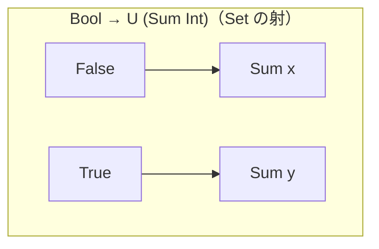
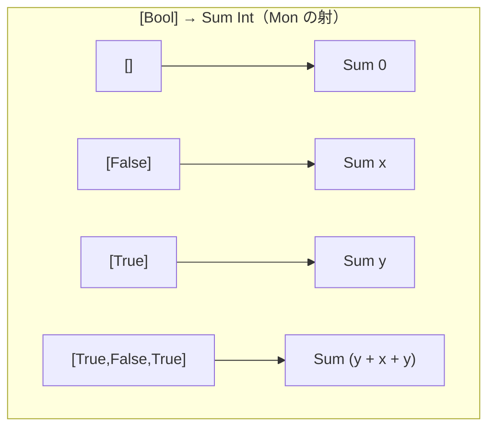
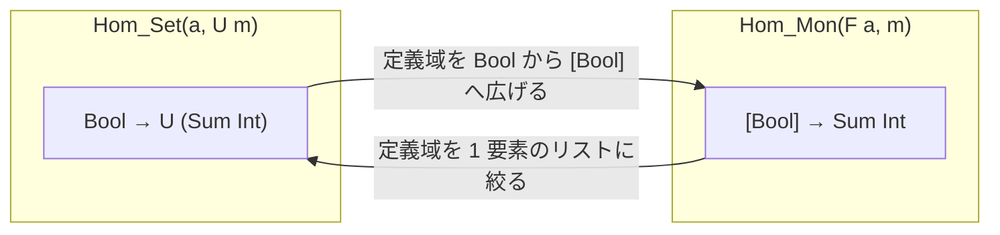
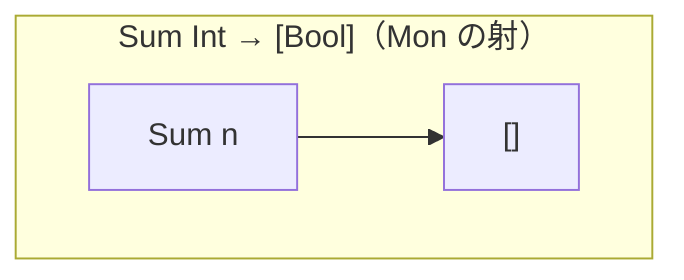
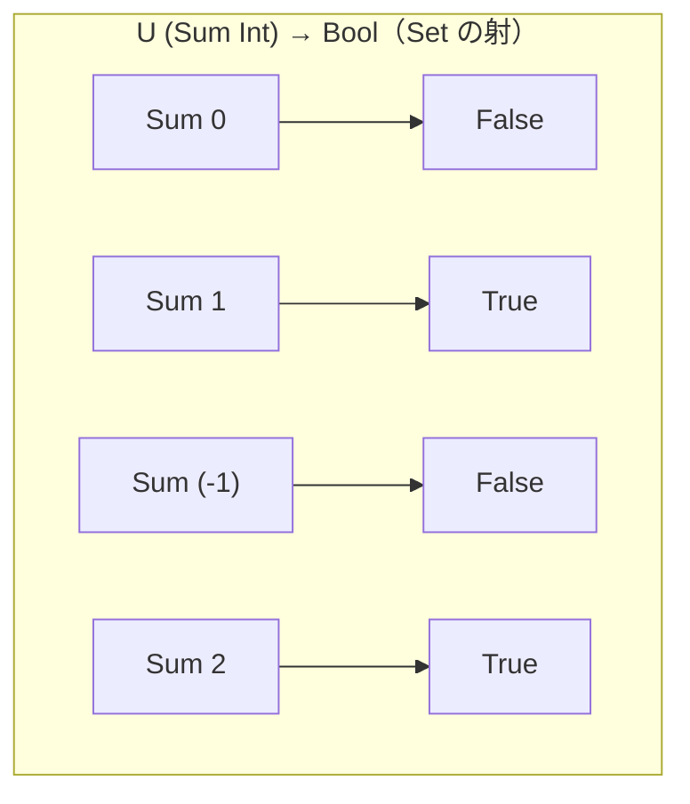
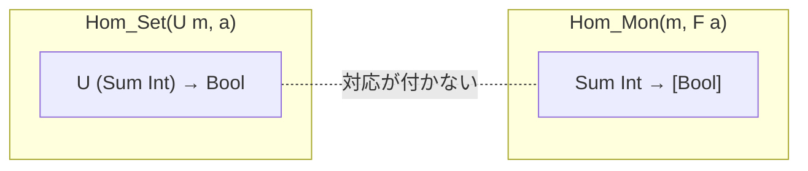
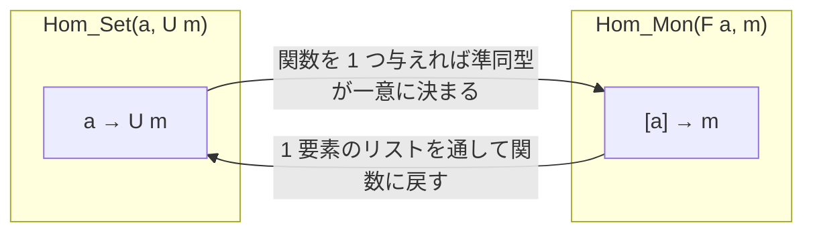

Haskell の解説で圏論の名前を見かけることがありますが、このシリーズは一貫して圏論に言及せずに進めてきました。最終回となる今回では、コードから圏論の概念を眺めます。圏・関手・自然変換から「モナドは自己関手の圏におけるモノイド対象」まで、既に実装として通ってきたものに名前を与えていきます。

:::message
本記事の執筆には Claude Code (Opus 5) を利用しました。
:::

シリーズの記事です。

1. [Haskell 超入門](http://qiita.com/7shi/items/145f1234f8ec2af923ef)
1. [Haskell 代数的データ型 超入門](http://qiita.com/7shi/items/1ce76bde464b4a55c143)
1. [Haskell アクション 超入門](http://qiita.com/7shi/items/85afd7bbd5d6c4115ad6)
1. [Haskell ラムダ 超入門](http://qiita.com/7shi/items/1345bf32003faff435cb)
1. [Haskell アクションとラムダ 超入門](http://qiita.com/7shi/items/4a8a2807bb5186576c61)
1. [Haskell IOモナド 超入門](http://qiita.com/7shi/items/d3d3492ddd90d47160f2)
1. [Haskell リストモナド 超入門](http://qiita.com/7shi/items/deb19c4cba933590ffbf)
1. [Haskell Maybeモナド 超入門](http://qiita.com/7shi/items/c7d7eec066af0fe0688d)
1. [Haskell 状態系モナド 超入門](http://qiita.com/7shi/items/2e9bff5d88302de1a9e9)
1. [Haskell モナド変換子 超入門](http://qiita.com/7shi/items/4408b76624067c17e933)
1. [Haskell 例外処理 超入門](http://qiita.com/7shi/items/73e534c47bbebc71b37e)
1. [Haskell 構文解析 超入門](http://qiita.com/7shi/items/b8c741e78a96ea2c10fe)
1. [Haskell 継続モナド 超入門](https://zenn.dev/7shi/articles/20260803-haskell-continuation-monad)
1. [Haskell 型クラス 超入門](https://zenn.dev/7shi/articles/20260805-haskell-type-classes)
1. [Haskell モナドとゆかいな仲間たち](https://zenn.dev/7shi/articles/20260807-haskell-monads-and-friends)
1. [Haskell Freeモナド 超入門](https://zenn.dev/7shi/articles/20260808-haskell-free-monad)
1. [Haskell Operationalモナド 超入門](https://zenn.dev/7shi/articles/20260809-haskell-operational-monad)
1. [Haskell Effモナド 超入門](https://zenn.dev/7shi/articles/20260811-haskell-eff-monad)
1. [Haskell アロー 超入門](https://zenn.dev/7shi/articles/20260813-haskell-arrow)
1. **Haskell 圏論 超入門** ← この記事

# 概要

このシリーズは「圏論には言及しない」という方針で書いてきました。理由は、既にあるモナドは圏論の知識がなくても使えるためです。通常のプログラミング言語と同様のアプローチで、書いて動かすことを優先しました。

最終回となる今回、初めて圏論に言及します。Haskell のコードから圏論の概念を眺めます。

|シリーズで書いたコード|圏論の名前|
|---|---|
|`class Category cat` の `id`・`.`|圏|
|`(->)` のインスタンス|Hask 圏|
|`Functor` とファンクター則|（自己）関手|
|`forall a. f a -> g a` の形のハンドラー|自然変換|
|`instance Category (Kleisli m)`|Kleisli 圏|
|`join` と `return`、モナド則|モノイド対象|
|`Free` の「モナド則だけを満たす」|自由生成・随伴|
|`instr :>>= k` に `Functor` が不要|米田の補題・Coyoneda|

どれも既に動かしたものです。新しく覚えることは、コードに付ける用語と、その用語が表す概念だけです。

Haskell のコードで書けるものはコードで書き、対象と射のレベルの話や同型のように、コードにすると不自然になるものだけを数式にします。

:::message
本記事は圏論の入門の入門です。数学的な厳密さより、Haskell との対応を優先します。圏論の一般論（極限や随伴の一般定義など）には立ち入らず、詳細は数学書に譲ります。
:::

# 圏

前回、`>>>` の土台にある `Category` 型クラスを見ました。👉[アロー](https://zenn.dev/7shi/articles/20260813-haskell-arrow#category)

```hs
class Category cat where
    id  :: cat a a
    (.) :: cat b c -> cat a b -> cat a c
```

これが圏の定義そのものです。

**圏**（category）は、対象と射の集まりに、射の合成と恒等射を備えたものです。`Category` の各部分がそのまま対応します。

|`Category`|圏論|
|---|---|
|型 `a`・`b`|**対象**（object）|
|`cat a b`|`a` から `b` への**射**（morphism, arrow）|
|`.`|射の**合成**（composition）|
|`id`|**恒等射**（identity morphism）|

対象は「点」、射は「点から点への矢印」だと思ってください。

一番イメージしやすいのは `(->)` です。対象が型、射が関数になります。`Int` から `Int` への射は `(+ 3)` のような関数で、合成は関数合成、恒等射は恒等関数です。次節で Hask として扱います。

ここで注意が必要なのは、射は関数とは限らないことです。`cat a b` が何であるかはインスタンスが決めます。

要求される性質は 2 つだけです。合成が結合的であること。

$$
(f \circ g) \circ h = f \circ (g \circ h)
$$

そして恒等射が合成の単位元であること。

$$
\mathrm{id} \circ f = f = f \circ \mathrm{id}
$$

前回、`(->)` について `id >>> f = f`・`f >>> id = f` を確認し、こう書きました。

> `Category` が `id` に求めているのはこの性質です。恒等関数であることが求められているわけではありません。

圏の言葉では、これが恒等射の定義です。恒等射とは、合成しても相手を変えない射のことであって、「何もしない関数」のことではありません。

## Hask 圏

Haskell そのものを圏とみなしたものを Hask と呼びます。対象は Haskell の型、射は関数です。

```hs
instance Category (->) where
    id x = x
    g . f = \x -> g (f x)
```

このインスタンスが Hask にあたります。合成は関数合成、恒等射は恒等関数です。`Int` から `String` への射とは `Int -> String` という型の関数のことで、その関数が何本あってもすべて別の射です。

シリーズで書いてきた関数はすべて Hask の射です。これから出てくる関手も自然変換も、Hask の上で考えます。

### bottom

Hask には避けて通れない問題があります。Haskell のすべての型は `undefined` と、停止しない計算を要素として持ちます。これらをまとめて **bottom**（$\bot$）と呼びます。

`undefined :: Int` は型検査を通り、`Int` の値のつもりで扱えますが、評価すると例外が発生します。

```hs:GHCi
ghci> undefined :: Int
*** Exception: Prelude.undefined
CallStack (from HasCallStack):
  undefined, called at <interactive>:1:1 in interactive:Ghci1
```

停止しない計算とは、次のような無限ループのことです。

```hs
loop :: Int
loop = loop
```

これも型は `Int` なので `Int` の値として扱えますが、評価すると例外すら出ないまま走り続け、返ってきません。GHCi で試す場合は Ctrl+C で中断する必要があります。

例外で落ちるか、返ってこないかという違いはありますが、どちらも「その型の値が得られない」という点では共通しています。これは `Int` に限らず、`Bool` でも `String` でも `Int -> Int` でも成り立ちます。

bottom があるだけなら「そういう値がある」で済みます。話が変わるのは `seq` があるときです。

### seq と WHNF

`seq` は第 1 引数を評価してから第 2 引数を返す関数です。Haskell は遅延評価なので、式は必要になるまで評価されません。`seq` はその評価を強制しますが、最後まで進めるわけではなく、途中で打ち切ります。打ち切る位置を**弱頭正規形**（WHNF: Weak Head Normal Form）と呼び、一番外側にデータ構築子（コンストラクター）かラムダが現れた時点がそれにあたります。

```hs:GHCi
ghci> seq (1+1, 2+2) 0
0
ghci> seq (\_ -> undefined) 0
0
```

`(1+1, 2+2)` はデータ構築子 `(,)` が既に見えているので、それだけで WHNF です。中身の `1+1` は未評価のまま残ります。`\_ -> undefined` も同じで、ラムダが見えている時点で打ち切られるため、本体の `undefined` には触れません。逆に `1+1` それ自体は WHNF ではありません。一番外側が `(+)` の適用のままだからです。

「弱」は中身まで潜らないという意味です。中身まで簡約しきって、どこにも簡約できる箇所が残っていない状態は正規形と呼び、区別します。この違いは bottom を含む値ではっきり出ます。

```hs:GHCi
ghci> seq (undefined, undefined) 0
0
ghci> seq (undefined :: Int) 0
*** Exception: Prelude.undefined
```

要素が両方 bottom でも、タプルのデータ構築子 `(,)` が見えていれば WHNF に達します。一方、`Int` の bottom はデータ構築子が現れないので、打ち切る場所がないまま bottom に当たります。`length [undefined, undefined]` が `2` を返せるのも同じ理屈で、リストの構造だけを辿り、要素には触れないためです。

つまり `seq` は「一番外側の形が決まるか、それとも bottom か」を観測します。

### seq が壊すもの

`seq` によるこの観測が、圏としての Hask を壊します。

関数型の bottom を用意して、`fmap id` と `id` を適用した結果を `seq` に掛けてみます。

```hs:GHCi
ghci> bot = undefined :: Int -> Int
ghci> seq (fmap id bot) 0
0
ghci> seq (id bot) 0
*** Exception: Prelude.undefined
CallStack (from HasCallStack):
  undefined, called at <interactive>:1:7 in interactive:Ghci1
```

関数の `fmap` は `.` なので、`fmap id bot` は `id . bot` になります。これはラムダ式なので、中身を呼ばない限り WHNF に達します。一方 `id bot` は `bot` そのものなので bottom に当たります。

違いが出るのは `seq` に掛けたときだけです。`fmap id bot` も `id bot` も型は `Int -> Int` なので、`Int` を与えて呼び出せます。

```hs:GHCi
ghci> fmap id bot 5
*** Exception: Prelude.undefined
CallStack (from HasCallStack):
  undefined, called at <interactive>:1:7 in interactive:Ghci1
ghci> id bot 5
*** Exception: Prelude.undefined
CallStack (from HasCallStack):
  undefined, called at <interactive>:1:7 in interactive:Ghci1
```

どちらも `bot` を呼ぶことになるので、`5` を他のどの `Int` に変えても結果は同じです。それでも `seq` は両者を区別します。つまり `fmap id` と `id` は、関数としては同じでも `seq` の下では別物です。後で見るファンクター則の 1 つ目が、この意味で破れています。

圏を作るには「2 つの射が等しい」ことがはっきり決まる必要がありますが、`seq` はその判定を壊します。これが、Hask が厳密には圏にならない理由です。

これは知られた問題で、Hask を圏として扱う議論はたいてい「bottom と `seq` を無視する」という前提を置いています。無視すれば対応はきれいに取れますし、実際のコードでも `seq` を使わなければ困りません。

以降では、bottom は無視して Hask を圏として扱います。ただし、無視していることは覚えておいてください。

:::message
無視してよい理由には裏付けもあります。「甘い推論は道徳的に正しい」（Fast and Loose Reasoning is Morally Correct）という標語で知られる結果があり、bottom を無視して導いた等式は、条件を満たせば bottom がある世界でも成り立つことが示されています。
:::

## 一点圏

Hask の射は関数でしたが、圏一般では射が関数とは限りません。関数でない例を作ってみます。

出発点は Hask です。`(+ 3)` と `(+ 4)` を合成すると、7 を足す関数になります。

```hs:GHCi
ghci> ((+ 3) . (+ 4)) 0
7
ghci> ((+ 3) . (+ 4)) 10
17
```

合成の結果を決めているのは 3 と 4 という数だけです。関数の形を捨てて数だけを残しても、同じことができそうに見えます。

### モノイドを圏にする

型クラスの回で扱ったモノイドは、単位元 `mempty` を持ち、`<>` で結合でき、結合法則を満たす型でした。👉[型クラス](https://zenn.dev/7shi/articles/20260805-haskell-type-classes#semigroup-と-monoid)

`Int` そのものは `Monoid` ではありません。足し算も掛け算もモノイドですが、一方に決められないためです。`Data.Monoid` には、ラッパーが用意されています。足し算にあたるのが `Sum` です。

```hs:GHCi
ghci> import Data.Monoid
ghci> Sum 3 <> Sum 4
Sum {getSum = 7}
ghci> mempty :: Sum Int
Sum {getSum = 0}
```

`Sum 3 <> Sum 4` が `Sum 7` になるのは、`(+ 3) . (+ 4)` が 7 を足す関数になるのに対応します。関数だったものが `Sum Int` というただの値に、合成が `<>` に置き換わっています。単位元 `Sum 0` が、何も足さない関数にあたります。

圏に求められるのも単位元と結合法則でした。モノイドはそれを満たすので、そのまま `Category` のインスタンスとして書けます。既存の `Monoid` との名前衝突を回避するため、ここでは型名を `Mono` とします。

```hs:Mono.hs
import Control.Category
import Data.Monoid (Sum(..))
import Prelude hiding ((.), id)

newtype Mono m a b = Mono m deriving (Show, Eq)

instance Monoid m => Category (Mono m) where
    id = Mono mempty
    Mono g . Mono f = Mono (f <> g)
```

`id` の実体が `mempty`、`.` の実体が `<>` です。インスタンスになっているのは `Mono` ではなく `Mono m` で、モノイドを 1 つ決めて初めて圏になります。

### 幽霊型と対象

`Mono m a b` の `a`・`b` は、`newtype` 宣言の右辺 `Mono m` に現れません。このように使われない型引数を**幽霊型**（phantom type）と呼びます。射の中身は `m` の値だけで、`m` に入れる `Sum Int` が数を扱う `Int` を持っているため、`a`・`b` が持つものは何もありません。`(+ 3)` を `Sum 3` に置き換えたことで、関数としての形は消えています。

その `a`・`b` が対象にあたります。持つものが何も無いので、ここでは空であることを表す `()` を入れます。どの射も `()` から `()` へ向かうことになり、結果として圏の対象は `()` 1 つだけになります。足し算のモノイドなら射の型は `Mono (Sum Int) () ()` で、`(->)` の型と並べてみます。

```hs
--              cat            a   b
     (+   3) :: (->)           Int Int
Mono (Sum 3) :: Mono (Sum Int) ()  ()
```

`Int` の位置が動いていることに注意してください。`(->)` の側では対象でしたが、`Mono` の側では `cat` が指す `Mono (Sum Int)` の中にあります。同じ `Int` が、`(->)` の側では対象、`Mono` の側では射を決める型の一部として機能しています。

|`cat a b`|`(->) Int Int`|`Mono (Sum Int) () ()`|
|---|---|---|
|対象|`Int`|`()`|
|射（例）|`(+ 3)`|`Mono (Sum 3)`|
|合成|関数合成|`<>`|
|恒等射|恒等関数|`Mono (Sum 0)`|

射はどちらも矢印の両端が同じ対象なので、どの射とどの射でも合成できます。違いは射の集まりで、左は `Int -> Int` の関数すべて、右はそのうち「n を足す」ものだけにあたります。

:::message
`()` を入れるのはここでの取り決めです。`a`・`b` には何でも入るので、`Mono (Sum Int) Bool Char` のような型も通ります。それでも射の中身は `Sum Int` の値のままで変わりません。
:::

これで `Mono (Sum Int)` という圏が 1 つできました。単位元と結合法則は、モノイド則がそのまま保証します。`Mono` の定義が使っているのは `mempty` と `<>` だけで、`Sum` に固有のものは何もありません。

### モノイドを取り替える

制約が `Monoid m =>` なので、`Sum` 以外のモノイドからも同じように圏が作れます。

まず、掛け算にあたる `Product` で、モノイドとしての動作を確認します。

```hs:GHCi
ghci> Product 3 <> Product 4
Product {getProduct = 12}
ghci> mempty :: Product Int
Product {getProduct = 1}
```

結合の結果も単位元も `Sum` とは異なりますが、どれも `<>` と `mempty` という同じ形に収まっています。

シリーズで使い続けてきたリストも `Monoid` のインスタンスです。

```hs:GHCi
ghci> ["a"] <> ["b"] <> ["c"]
["a","b","c"]
ghci> mempty :: [String]
[]
```

リストも `<>` と `mempty` を備えているので、`Mono [String]` という圏になります。`Mono (Sum Int)` とは別の圏で、射も恒等射も異なります。

### モノイドと一点圏

`Mono.hs` を GHCi に読み込んで、`Sum Int` とリストを並べて試します。

```hs:GHCi
ghci> :load Mono.hs
[1 of 2] Compiling Main             ( Mono.hs, interpreted )
Ok, one module loaded.
ghci> Mono (Sum 3) >>> Mono (Sum 4) :: Mono (Sum Int) () ()
Mono (Sum {getSum = 7})
ghci> Mono ["a"] >>> Mono ["b"] >>> Mono ["c"] :: Mono [String] () ()
Mono ["a","b","c"]
ghci> id :: Mono (Sum Int) () ()
Mono (Sum {getSum = 0})
ghci> id :: Mono [String] () ()
Mono []
```

`a`・`b` は幽霊型で値から決まらないため、型注釈で `()` を指定しています。

合成は `Sum Int` なら足し算、リストなら連結です。`id` と書いているのは同じですが、型注釈で指定したモノイドによって `Mono (Sum 0)` にも `Mono []` にもなります。実体は `mempty` なので当然で、射も恒等射もモノイドごとに異なります。

`Mono` が射として扱うのは `m` の要素そのものです。ここでの射は `Sum 3` や `["a"]` といったただの値で、関数ではありません。恒等射も `Sum 0` や `[]` であって、恒等関数とは無関係です。`Category` が `id` に求めるのが単位元という性質だけだったことが、ここではっきりします。

Hask では射が関数でしたが、それは `(->)` というインスタンスが持っていた性質であって、圏一般の性質ではありません。圏が射に求めているのは、合成できることと恒等射があることだけです。`<>` で合成できて `mempty` という単位元がある以上、リストも射としての条件を満たしています。

:::message
`Sum 3` は `(+ 3)` と対応していたためまだ関数の面影がありましたが、`["a"]` にはそのような対応物がありません。

強いて言えば、文字列で操作を表すことで、リストを手順書とみなすことは可能です。例えば `["+ 3", "+ 4"]` を `(+ 3) >>> (+ 4)` に対応させるようなことです。もっとも、常にこのような解釈ができるわけではないため、あまり関数に結びつけようとせず、射は射として扱う方が自然です。
:::

`Mono m` のように、対象が 1 つしかない圏を**一点圏**（one-object category）と呼びます。逆向きに読むこともできます。モノイドとは一点圏のことです。圏の方が広く、対象を 1 つに絞るとモノイドになります。この見方は後で効いてきます。

# 関手

Haskell の `Functor` は `fmap` を持つ型クラスです。👉[モナドとゆかいな仲間たち](https://zenn.dev/7shi/articles/20260807-haskell-monads-and-friends#ファンクター則)

```hs
class Functor f where
    fmap :: (a -> b) -> f a -> f b
```

functor は**関手**と訳されます。関手とは圏から圏への 2 つの対応の組です。圏論での関手を $F$、Haskell の `Functor` のインスタンスを `f` とすると、対応は次のようになります。

|対応|関手|Haskell|意味|
|---|---|---|---|
|対象|$a \mapsto F a$|`a` → `f a`|対象 $a$ を対象 $F a$ に移す|
|射|$g \mapsto F g$|`g` → `fmap g`|射 $g : a \to b$ を射 $F g : F a \to F b$ に持ち上げる|

圏論では $F$ という 1 つの記号が両方の対応を兼ねます。$F a$ と $F g$ は同じ形に書きますが、$F g$ は $g$ を $F$ で包んだものではありません。射の対応という別の写像を、対象の対応と同じ記号で書いています。

Haskell では、型構築子 `f` と関数 `fmap` に分かれています。

:::message
Haskell には関数を包んだ形も出てきます。`Just (+ 1) :: Maybe (Int -> Int)` は引数を直接受け取れないため `<*>` が必要です。一方、$F g$ にあたるのは `fmap (+ 1) :: Maybe Int -> Maybe Int` の方で、こちらは `Maybe Int` を直接受け取れる関数です。👉[モナドとゆかいな仲間たち](https://zenn.dev/7shi/articles/20260807-haskell-monads-and-friends#applicative)
:::

射の対応を `Maybe`・リスト・`Either String` の 3 つで確かめます。

```hs:Functor.hs
g, h :: Int -> Int
g = (* 2)
h = (+ 1)

main :: IO ()
main = do
    -- 射の対応: a -> b を f a -> f b に移す
    print $ fmap h (Just 3)
    print $ fmap h [1, 2, 3]
    print $ fmap h (Right 3 :: Either String Int)
    -- fmap id == id
    print $ fmap id (Just 3)  == id (Just 3)
    print $ fmap id [1, 2, 3] == id [1, 2, 3]
    -- fmap (g . h) == fmap g . fmap h
    print $ fmap (g . h) (Just 3)  == (fmap g . fmap h) (Just 3)
    print $ fmap (g . h) [1, 2, 3] == (fmap g . fmap h) [1, 2, 3]
```
```text:実行結果
Just 4
[2,3,4]
Right 4
True
True
True
True
```

同じ関数 `(+ 1)` が `Maybe`・リスト・`Either String` の 3 つに持ち上がっています。どの持ち上げ方をするかを決めているのが `fmap` で、対象の対応だけでは決まりません。関手が 2 つの対応の組だというのは、この意味です。

後半 4 行はファンクター則です。

```hs
fmap id      == id               -- 単位元
fmap (g . h) == fmap g . fmap h  -- 準同型
```

これは圏の言葉では関手が恒等射と合成を保つことの要求です。

$$
F\,\mathrm{id} = \mathrm{id} \qquad F(g \circ h) = F g \circ F h
$$

モナドを自作する回では、`fmap` を「関数合成という構造を保つ準同型」と説明しました。関手の定義は、まさにこの 2 本です。ファンクター則を満たさない `Functor` インスタンスは関手ではありません。

## 自己関手

関手は一般には圏 $\mathcal{C}$ から別の圏 $\mathcal{D}$ への対応ですが、`Functor` のインスタンスはすべて Hask から Hask への対応です。`Maybe Int` も `[Int]` も Haskell の型なので、行き先は Hask の中に留まります。

このように出発点と行き先が同じ圏である関手を**自己関手**（endofunctor）と呼びます。

型で見ると `f :: * -> *` という種がその現れです。型を受け取って型を返すので、Hask の対象から Hask の対象への対応になります。👉[Freeモナド](https://zenn.dev/7shi/articles/20260808-haskell-free-monad#種)

Haskell の `Functor` インスタンスは、すべて自己関手です。「自己関手の圏」という言い方が後で出てきますが、その「自己関手」はこのことです。

モナドも自己関手です。`Monad` は `Applicative` を、`Applicative` は `Functor` をスーパークラスに持つので、`Monad` のインスタンスは必ず `Functor` のインスタンスでもあるためです。👉[型クラス](https://zenn.dev/7shi/articles/20260805-haskell-type-classes#スーパークラス)

# 自然変換

Free モナドの回で、手順書を別のモナドへ移す `foldFree` を使いました。👉[Freeモナド](https://zenn.dev/7shi/articles/20260808-haskell-free-monad#free-パッケージ)

```hs
foldFree :: Monad m => (forall x. f x -> m x) -> Free f a -> m a
```

Eff モナドの回で、ハンドラーを組み立てる `interpret` も同じ形でした。👉[Effモナド](https://zenn.dev/7shi/articles/20260811-haskell-eff-monad#環境からハンドラーを取り出す)

```hs
interpret :: (forall x. e x -> Eff es x) -> Eff (e ': es) a -> Eff es a
```

どちらも第 1 引数が `forall x. f x -> m x` の形をしています。命令の型 `f` を、実際に動くモナド `m` へ変換する関数を渡し、それを手順書全体へ広げるという役割も共通です。

この形に名前が付いています。**自然変換**（natural transformation）です。関手から関手への対応で、圏論では射・関手に続く 3 段目の概念にあたります。

型シノニムにすると読みやすくなります。

```hs
type f ~> g = forall a. f a -> g a
```

`~>` は base には入っていませんが、ライブラリでもよく使われます。

実例として、リストと `Maybe` を行き来する関数があります。どちらも `Data.Maybe` にありますが、中身が短いので定義を示します。

```hs:Natural.hs
type f ~> g = forall a. f a -> g a

listToMaybe :: [] ~> Maybe
listToMaybe []      = Nothing
listToMaybe (x : _) = Just x

maybeToList :: Maybe ~> []
maybeToList Nothing  = []
maybeToList (Just x) = [x]
```

`listToMaybe` はリストの先頭を取り出す関数、`maybeToList` は `Maybe` をリストにする関数です。

型に注目してください。`~>` で書くと、リストという関手から `Maybe` という関手への対応、あるいはその逆になっていることが見えます。通常の書き方をすると `[a] -> Maybe a` と `Maybe a -> [a]` で、こちらでは `a` に目が行きます。

中身の型 `a` が何であっても同じように振る舞う、というのが `forall a.` の意味です。`listToMaybe` は要素が `Int` でも `String` でも先頭を取るだけで、中身の値を見ません。捨てたり並べ替えたりはできますが、それは構造だけを見て決まることで、要素の値そのものを調べたり作り変えたりはできません。自然変換とは、このように要素の値に立ち入らず、関手の構造だけで決まる対応のことです。

## 自然性

「要素の値に立ち入らない」を式にしたものが**自然性条件**（naturality condition）です。自然変換を `alpha`、中身を書き換える関数を `h` とします。

```hs
fmap h . alpha == alpha . fmap h
```

左辺は「関手を移してから要素を書き換える」、右辺は「要素を書き換えてから関手を移す」です。どちらの順でも同じ結果になることを要求しています。

自然変換は 1 本の射ではなく、対象ごとに 1 本ずつ用意された射の族として定義されます。この 1 本 1 本を**成分**（component）と呼び、$\alpha_a$ のように対象を添字にして書きます。Haskell では `forall a.` の 1 つの定義が族全体を引き受けるため、成分を個別に書くことはありません。型を固定したときの 1 本が成分にあたります。

:::message
Haskell では、`forall a.` の形をした関数は自然性条件を自動的に満たします。
:::

成分を使って、先ほどの等式を図にします。$\alpha$ を関手 $F$ から関手 $G$ への自然変換、$h : a \to b$ を射とします。

$$
\begin{CD}
F a @>{\alpha_a}>> G a \\
@V{F h}VV @VV{G h}V \\
F b @>{\alpha_b}>> G b
\end{CD}
$$

横の $\alpha_a, \alpha_b$ は成分で、対象ごとに用意された射です。Haskell では `forall a.` の多相関数を型ごとに見たものにあたります。縦の $F h, G h$ は、関手の節で見た射の対応です。$h$ をそれぞれの関手へ持ち上げたもので、Haskell では `fmap h` にあたります。

左上から右下へ行く道が 2 本あります。右へ行ってから下へ降りる道と、下へ降りてから右へ行く道です。この 2 本が同じところに着くというのが**自然性**です。このように「どの道を通っても同じ」ことを表す図を**可換図式**（commutative diagram）と呼びます。

実際に両辺を評価します。

```hs:Natural.hs
h :: Int -> String
h = show

main :: IO ()
main = do
    -- 自然性: fmap h . listToMaybe == listToMaybe . fmap h
    print $ (fmap h . listToMaybe) [1, 2, 3]
    print $ (listToMaybe . fmap h) [1, 2, 3]
    print $ (fmap h . listToMaybe) ([] :: [Int])
    print $ (listToMaybe . fmap h) ([] :: [Int])
    print $ (fmap h . maybeToList) (Just 1)
    print $ (maybeToList . fmap h) (Just 1)
    print $ (fmap h . maybeToList) (Nothing :: Maybe Int)
    print $ (maybeToList . fmap h) (Nothing :: Maybe Int)
```
```text:実行結果
Just "1"
Just "1"
Nothing
Nothing
["1"]
["1"]
[]
[]
```

上から 2 行ずつが対になっています。空の場合も含めて、どちらの順でも一致しています。

:::message
自然性条件は等式ですが、これは実装を見なくても `forall a.` という型だけから成り立ちます。このように型から動作が制限される性質を**パラメトリシティ**（parametricity）と呼び、そこから導ける等式を**自由定理**（free theorem）と呼びます。自然性条件はその一例です。

ただし bottom を無視した場合の話です。`seq` や `undefined` を持ち込むと成り立たなくなります。
:::

# Kleisli 圏

前回、モナドを返す関数 `a -> m b` をつなぐために `Kleisli` を使いました。👉[アロー](https://zenn.dev/7shi/articles/20260813-haskell-arrow#kleisli)

```hs
newtype Kleisli m a b = Kleisli { runKleisli :: a -> m b }

instance Monad m => Category (Kleisli m) where
    id = Kleisli return
    Kleisli g . Kleisli f = Kleisli (\x -> f x >>= g)
```

`Category` のインスタンスなので、これも圏です。名前が付いています。**Kleisli 圏**（Kleisli category）です。

|Kleisli 圏|中身|
|---|---|
|対象|Haskell の型（Hask と同じ）|
|射 `a` → `b`|`a -> m b`|
|合成|`>=>`|
|恒等射|`return`|

対象は Hask と同じですが、射が違います。Hask で `a` から `b` への射は `a -> b` でしたが、Kleisli 圏では `a -> m b` です。同じ対象の上に別の射を敷いた圏ということになります。

ここでも「`a` から `b` への射」は `b` を返す関数ではありません。返ってくるのは `m b` です。`b` は合成の辻褄を合わせるための名前として機能しています。

モナド `m` ごとに Kleisli 圏が 1 つ決まります。`Kleisli Maybe` なら失敗する計算の圏、`Kleisli []` なら非決定性計算の圏です。

:::message
非決定性計算とは、1 つの入力に対して結果の候補が複数あり、どれか 1 つに定まらない計算のことです。`a -> [b]` という射は、その候補をリストに並べたものと読めます。候補が 1 つもない場合は空リストになります。

`>=>` でつなぐと、前段が出した候補のそれぞれに後段を適用し、出てきた候補をすべて集めて次へ渡します。枝分かれが枝分かれのまま積み上がっていくわけです。この後の動作確認で実際に増えていく様子を見ます。
:::

ここでモナド則を思い出します。`>=>` で書き直したものでした。👉[モナドとゆかいな仲間たち](https://zenn.dev/7shi/articles/20260807-haskell-monads-and-friends#-で書き直す)

```hs
return >=> f    == f                -- 左単位元
f >=> return    == f                -- 右単位元
(f >=> g) >=> h == f >=> (g >=> h)  -- 結合法則
```

これは圏の公理そのものです。単位律が 2 本と結合律が 1 本、恒等射が `return`、合成が `>=>`。最初の節で書いた圏の要求と一字一句同じ形をしています。

つまりモナド則とは「Kleisli 圏が圏であること」の要求でした。モナドが満たすべき性質として天下り式に与えられていたものが、圏の側から見ると当たり前の要求だったことになります。

リストで確かめます。非決定性計算にあたるモナドです。👉[リストモナド](https://qiita.com/7shi/items/deb19c4cba933590ffbf)

```hs:Kleisli.hs
import Control.Arrow (Kleisli(..))
import Control.Category ((>>>))
import Control.Monad ((>=>))

-- 1 手で「1 を足す」か「2 倍する」（非決定性計算）
step :: Int -> [Int]
step n = [n + 1, n * 2]

main :: IO ()
main = do
    print $ step 3
    print $ (step >=> step) 3
    print $ (step >=> step >=> step) 3
    -- 左単位元・右単位元
    print $ (return >=> step) 3 == step 3
    print $ (step >=> return) 3 == step 3
    -- 結合法則
    print $ ((step >=> step) >=> step) 3 == (step >=> (step >=> step)) 3
    -- Kleisli の >>> でも同じ
    print $ runKleisli (Kleisli step >>> Kleisli step) 3
```
```text:実行結果
[4,6]
[5,8,7,12]
[6,10,9,16,8,14,13,24]
True
True
True
[5,8,7,12]
```

`step` を `>=>` でつなぐたびに、到達できる値が倍に増えていきます。この合成が結合的で、`return` が単位元になっていることが 3 つの `True` です。

新しいコードは何もありません。前回書いた `Kleisli` のインスタンスに、Kleisli 圏という名前が付いただけです。

# 自己関手の圏におけるモノイド対象

モナドの難解さを端的に表すミームとして有名なフレーズがあります。👉[参考](#参考)

> モナドは単なる自己関手の圏におけるモノイド対象だよ。何か問題でも？

まず道具を準備してから、このフレーズを説明します。

## join

まず主役を `>>=` から `join` に取り替えます。`Control.Monad` にある関数です。

```hs
join :: Monad m => m (m a) -> m a
```

2 重に包まれたモナドを 1 層剥がして平らにします。リストなら `[[1,2],[3]]` を `[1,2,3]` にする関数です。

`>>=` と `join` は相互に定義できます。

```hs:Join.hs
import Control.Monad (join)

bind :: Monad m => m a -> (a -> m b) -> m b
bind m k = join (fmap k m)

join' :: Monad m => m (m a) -> m a
join' mm = mm >>= id

main :: IO ()
main = do
    print $ [1, 2, 3] `bind` \x -> [x, x * 10]
    print $ [1, 2, 3] >>=    \x -> [x, x * 10]
    print $ join' [[1, 2], [3]]
    print $ join  [[1, 2], [3]]
    print $ Just 3 `bind` \x -> Just (x * 2)
    print $ join' (Just (Just 3))
```
```text:実行結果
[1,10,2,20,3,30]
[1,10,2,20,3,30]
[1,2,3]
[1,2,3]
Just 6
Just 3
```

`bind m k = join (fmap k m)` は「`fmap` で中身に関数を適用すると 2 重になるので `join` で潰す」という定義です。逆に `join mm = mm >>= id` は「取り出したものをそのまま返す」だけです。

どちらを基本に取っても同じモナドになります。Haskell は `>>=` を基本に選んでいますが、圏論では `join` を基本に選びます。`join` の方が圏論の道具立てに乗せやすいためです。

### モナド則の書き換え

Kleisli 圏の節で見た `>=>` 版のモナド則を、`join` の側に書き換えておきます。手掛かりは以下の定義です。

```hs
f >=> g = \x -> f x >>= g
join mm = mm >>= id
```

`f` と `g` を両方 `id` にすれば、`join` が現れます。モナド則が Kleisli 射すべてについて成り立つため、`id` に置き換えることができます。Kleisli 射は `a -> m b` の形ですが、`a` に `m b` を選べば `m b -> m b` になり、`id` の型と一致します。

```hs
id >=> id == \x -> id x >>= id
          == \x -> x >>= id
          == \x -> join x
          == join
```

よって、3 本の等式の `f`・`g`・`h` をすべて `id` に置き換えれば、`>=>` 版が `join` 版に移ります。計算を追いやすくするため、`>=>` を `join` と `fmap` で書き直しておきます。

```hs
f x >>= g == join  (fmap g  (f x))
f   >=> g == join . fmap g . f
```

これによって置き換えれば `fmap id` と `id` が消えて、`join` だけが残ります。

```hs
-- 左単位元
return >=> id == id
join . fmap id . return == id
join . return == id

-- 右単位元
id >=> return == id
join . fmap return . id == id
join . fmap return == id

-- 結合法則
(id >=> id) >=> id == id >=> (id >=> id)
join . fmap id . join == join . fmap (join . fmap id . id)
join . join == join . fmap join
```

こうして得られた 3 本が、`join` 側から見たモナド則です。

```hs
join . return == id              -- 左単位元
join . fmap return == id         -- 右単位元
join . join == join . fmap join  -- 結合法則
```

3 本とも `join .` の形にまとまっています。`join` は最後に必ず 1 回だけ実行される、という形です。

## μ と η

`join` と `return` を、前節の自然変換として読み直します。

```hs
join   :: m (m a) -> m a
return :: a -> m a
```

モナドを表す自己関手を $T$ と書きます。Haskell の `m` にあたります。$T \circ T$ は $T$ を 2 回続けて適用する関手で、`m (m a)` にあたります。合成の回数が増えると読みにくくなるため、以降は 2 回なら $T^2$、3 回なら $T^3$ と略記します。

これで `join` を読み直せます。2 重に重ねた `m` から `m` への対応なので、$T^2$ から $T$ への自然変換です。

`return` の方は少し細工が必要です。`a -> m a` の左辺には関手がありません。ここで `Identity` を持ち出します。中身をそのまま持つだけの関手でした。👉[モナドとゆかいな仲間たち](https://zenn.dev/7shi/articles/20260807-haskell-monads-and-friends#identity)

`a` を `Identity a` と読み替えれば、`return` は `Identity a -> m a`、つまり恒等関手 $\mathrm{Id}$ から $T$ への自然変換になります。

:::message
2 本の戻り値がどちらも `m a` になっているのは偶然ではありません。`join` は `m` を 2 層から 1 層にし、`return` は 0 層から 1 層にします。剥がすか包むかで向きは違いますが、どちらも「`m` が 1 層」に着地します。
:::

圏論ではこの 2 本に $\mu$（ミュー）と $\eta$（イータ）という名前が付いています。

|圏論|Haskell|
|---|---|
|$T$|`m`（自己関手）|
|$\mathrm{Id}$|`Identity`|
|$\mu : T^2 \Rightarrow T$|`join :: m (m a) -> m a`|
|$\eta : \mathrm{Id} \Rightarrow T$|`return :: a -> m a`|

$\mu,\eta$ はどちらも行き先が同じ $T$ です。矢印が $\to$ ではなく $\Rightarrow$ になっているのは、射ではなく自然変換だからです。自然変換は関手から関手への対応なので、射より段が 1 つ上がります。Haskell ではどちらも `->` で書かれてしまいますが、数式の側ではこのように書き分けます。

段を 1 つ下ろすには、対象 $a$ を 1 つ選んで成分を取り出します。成分は射なので、矢印は $\to$ に戻ります。

$$\mu_a : T(T a) \to T a \qquad \eta_a : a \to T a$$

表の Haskell 側とほぼ同じ型表記ですが、同じ `a` でも指すものは違います。Haskell の `a` は型変数で、`return` は多相な 1 つの定義としてすべての型の総称となっており、$\eta$ に対応します。数式の $a$ は選んだ対象 1 つなので、$\eta_a$ に対応するのは `return :: Int -> Maybe Int` のように型を固定した形です。

Haskell で型を固定するには、`@` で型引数を明示する記法が使えます。`return` の型変数は `m`・`a` の順に並んでいるため、`@Maybe @Int` と添えると `m` が `Maybe`、`a` が `Int` に決まります。

```hs:GHCi
ghci> :t return @Maybe @Int
return @Maybe @Int :: Int -> Maybe Int
```

これが $\eta_a$ にあたる形です。普段のコードでは型が推論されるため `@` を書く機会はほとんどありませんが、型変数の行き先を明示するには都合が良いので、以降でも使います。

:::message
圏論でも、モナドはまず自己関手 $T$ であり、そこへ $\mu$ と $\eta$ が加わったものとして定義されます。自己関手を土台に置く点は Haskell と同じですが、階層は一致しません。Haskell は `Functor` と `Monad` の間に `Applicative` を挟みますが、圏論のモナドの定義にそれにあたる段はありません。
:::

## ηT と μT

$\eta : \mathrm{Id} \Rightarrow T$ は $T$ を 0 層から 1 層にする自然変換です。既に $T$ が 1 層ある状態に適用すれば、$T$ は 1 層から 2 層になります。$T\eta$ は $\eta$ の型 $\mathrm{Id} \Rightarrow T$ の両側に左から $T \circ$ を付けると考えれば $(T \circ \mathrm{Id}) \Rightarrow (T \circ T)$ より $T \Rightarrow T^2$ となり、$\eta T$ も同様に右から $\circ T$ を付けて $(\mathrm{Id} \circ T) \Rightarrow (T \circ T)$ より $T \Rightarrow T^2$ となります。

$F \circ G$ において、左にある関手 $F$ が外側、右にある関手 $G$ が内側です。その目で先ほどの型を見れば、$T\eta$ は内側に $T$ が増え、$\eta T$ は外側に $T$ が増えていることが分かります。つまり、$\eta$ の位置に $T$ が増えているわけです。

$T\eta, T\mu$ は、関手 $T$ による持ち上げです。関手が射を $g \mapsto T g$ と対応させるのと同じことを、自然変換の成分に対して行います。Haskell の `fmap return`・`fmap join` にあたり、$T$ の内側に作用します。

$\eta T, \mu T$ は、$T$ の外側に作用します。Haskell では型変数 `a` をモナドに置き換えた形に相当します。`return :: a -> m a` の `a` を `m a` に置き換えれば `m a -> m (m a)` となり、外側に 1 層増えます。

ここまで見た 4 つを並べます。

|作用する側|圏論|Haskell|型|
|---|---|---|---|
|内側|$T\eta : T \Rightarrow T^2$|`fmap @m (return @m @a)`|`m a -> m (m a)`|
|外側|$\eta T : T \Rightarrow T^2$|`return @m @(m a)`|`m a -> m (m a)`|
|内側|$T\mu : T^3 \Rightarrow T^2$|`fmap @m (join @m @a)`|`m (m (m a)) -> m (m a)`|
|外側|$\mu T : T^3 \Rightarrow T^2$|`join @m @(m a)`|`m (m (m a)) -> m (m a)`|

対になった 2 つは型が同じです。区別しているのはどちら側に作用するかで、Haskell では `fmap` の有無がそれにあたります。リストに適用すると結果の違いが見えます。

```hs:Whisker.hs
tEta, etaT :: forall m a. Monad m => m a -> m (m a)
tEta = fmap @m (return @m @a)  -- Tη: 内側を m で包む
etaT = return @m @(m a)        -- ηT: 外側を m で包む

main :: IO ()
main = do
    print $ tEta [1, 2, 3 :: Int]
    print $ etaT [1, 2, 3 :: Int]
```
```text:実行結果
[[1],[2],[3]]
[[1,2,3]]
```

$T\eta$ は要素を 1 つずつリストで包み、$\eta T$ はリスト全体を包みます。

:::message
`@m` や `@a` と書けるのは、`forall m a.` で型変数がスコープに入っている場合です。GHCi で試すときは具体的な型を渡します。これらは説明のために付けているだけで、省略しても動きます。その場合は型変数を参照しなくなるため、シグネチャの `forall m a.` も不要になります。
:::

## 単位律と結合律の図式

`join` と `return` を使ったモナド則は、圏論の図式に書き換えられます。

まず単位律（単位元の法則）を図式にします。

```hs:単位律
join . return == id              -- 左単位元
join . fmap return == id         -- 右単位元
```

`join . return` と `join . fmap return` は、どちらも加えたモナドを剥がす操作です。外から包んでから剥がすか、内から包んでから剥がすかの違いで、どちらも $T$ に戻ります。

$$
\begin{CD}
T @>{\eta T}>> T^2 @<{T\eta}<< T \\
@| @VV{\mu}V @| \\
T @= T @= T
\end{CD}
$$

左右の端はどちらも $T$ で、縦線の等号はそこから何も変わらないことを表します。

|Haskell|圏論|図式の経路|
|---|---|---|
|`join . return`|$\mu \circ \eta T$|左上から $\eta T$ → $\mu$|
|`join . fmap return`|$\mu \circ T\eta$|右上から $T\eta$ → $\mu$|

2 つの経路はどちらも $T$ から $T$ へ戻り、両端の等号と一致します。その一致先が `id` です。

次に結合律（結合法則）を図式にします。

```hs:結合律
join . join == join . fmap join  -- 結合法則
```

`join . join` と `join . fmap join` は、3 重のモナドから 2 層を剥がす 2 通りの順序です。外側の 2 層を先に剥がすか、内側の 2 層を先に剥がすかの違いで、どちらも行先は同じです。

$$
\begin{CD}
T^3 @>{T\mu}>> T^2 \\
@V{\mu T}VV @VV{\mu}V \\
T^2 @>{\mu}>> T
\end{CD}
$$

|Haskell|圏論|図式の経路|
|---|---|---|
|`join . join`|$\mu \circ \mu T$|左辺 $\mu T$ → 下辺 $\mu$|
|`join . fmap join`|$\mu \circ T\mu$|上辺 $T\mu$ → 右辺 $\mu$|

この正方形が可換なので、2 つの経路は一致します。

## モノイド則

モナドには、モノイドと似た構造があります。

一点圏の節では、モノイドを圏とみなしましたが、ここでは演算の側に注目します。`Monoid` のメソッドと `join`・`return` を並べると、形が揃っていることが見えてきます。

|`Monoid`|`Monad`|
|---|---|
|`(<>) :: a -> a -> a`|`join :: m (m a) -> m a`|
|`mempty :: a`|`return :: a -> m a`|

`<>` は同じ型のものを 2 つ受け取って 1 つにします。`join` は同じ関手を 2 つ重ねたものを 1 つにします。「2 つ並んだものを 1 つにする」という形が共通しています。`mempty` と `return` も、単位元を供給するという点で同じ位置にいます。`mempty` は `<>` の単位元で、`return` は `join` に対する単位元です。前節で見たとおり、`return` は恒等関手 $\mathrm{Id}$ から $T$ への自然変換で、$\mathrm{Id}$ は関手の合成の単位元にあたります。

満たすべき法則も対応しますが、`join` の形のままでは見比べにくいので、Kleisli 圏の節で見た `>=>` 版のモナド則を使います。`>=>` を `<>` に、`return` を `mempty` に読み替えれば、モノイド則と同じ形であることが分かります。ただし `<>` が結合するのは値で、`>=>` が合成するのは射です。

|`Monoid`|Kleisli 圏|
|---|---|
|`mempty <> x` == `x`|`return >=> f` == `f`|
|`x <> mempty` == `x`|`f >=> return` == `f`|
|`(x <> y) <> z` == `x <> (y <> z)`|`(f >=> g) >=> h` == `f >=> (g >=> h)`|

:::message
これは形が同じだという話であって、モナドが `Monoid` のインスタンスになるという意味ではありません。`Monoid` は型に対する型クラスですが、`m` は型ではなく型構築子です。`<>` が結合するのは同じ型の値 2 つで、`join` が剥がすのは値ではなく `m` です。リストのように `m a` が `Monoid` のインスタンスになる型もありますが、それはモナドとしての構造とは別のものです。
:::

モナドがモノイドの形をしているのは Hask の中ではありません。次節で見るとおり、別の圏の中での話になります。

## フレーズを読み解く

材料が揃ったので、いよいよフレーズを読み解きます。

> モナドは単なる自己関手の圏におけるモノイド対象だよ。何か問題でも？

圏は対象と射でできていました。ここでの対象は自己関手、射は自然変換です。`Maybe` や `[]` が点になり、`listToMaybe` のような自然変換がその間の矢印になる圏を考えます。これを Hask の**自己関手の圏**（category of endofunctors）と呼び、End(Hask) と書きます。

圏の中でモノイドのように振る舞う対象を**モノイド対象**と呼びます。一点圏の節でモノイドを圏とみなしましたが、今度は逆に、圏の中の 1 つの対象がモノイドの構造を持つ、という話になります。

普通のモノイドは、集合 $M$ と、掛け算 $M \times M \to M$ と、単位元 $1 \to M$ の組です。

単位元そのものは 1 つですが、$1 \to M$ という写像の形で書いてあります。圏論では元を直接指し示せないため、要素が 1 つだけの集合 $1 = \{ * \}$ を用意して、$*$ の行先として単位元を指定します。この $1$ を**単位集合**と呼びます。$*$ はその唯一の要素に付けた名前で、それ以上の意味はありません。Haskell の `()` 型がちょうど同じもので、`()` という値だけを持ちます。こう書いておけば掛け算と同じく射になり、集合以外の圏にも移せます。

:::message
$1 \to M$ は元を 1 つ選ぶ射で、掛け算のモノイドなら `const 1 :: () -> M` にあたります。`(* 1) :: M -> M` ではありません。単位元を選ぶだけで、掛けても変わらないという性質は法則の側が担います。

なお `(* 1)` が単位元として現れるのは一点圏の見方です。そちらでは元それぞれが射になり、単位元は恒等射にあたります。同じ単位元でも、一点圏では恒等射、モノイド対象では単位集合からの射として現れます。
:::

モノイドを End(Hask) に移植すれば、次のようになります。

|モノイド|表記|End(Hask) での対応|Haskell|
|---|---|---|---|
|集合|$M$|自己関手 $T$|`m`|
|直積|$M \times M$|関手の合成 $T^2$|`m (m a)`|
|掛け算|$M \times M \to M$|$\mu : T^2 \Rightarrow T$|`join`|
|単位集合|$1$|恒等関手 $\mathrm{Id}$|`Identity`|
|単位元|$1 \to M$|$\eta : \mathrm{Id} \Rightarrow T$|`return`|

直積が関手の合成に、単位集合が恒等関手に置き換わっています。どちらも「並べる演算」と「その単位元」という組になっていて、$1 \times M \cong M$ が $\mathrm{Id} \circ T = T$ にあたります。あとはモナド則を課せば、モノイドの定義がそのまま移植できます。

|モナド則|End(Hask)|Haskell|
|---|---|---|
|左単位元|$\mu \circ \eta T = \mathrm{id}$|`join . return == id`|
|右単位元|$\mu \circ T\eta = \mathrm{id}$|`join . fmap return == id`|
|結合法則|$\mu \circ \mu T = \mu \circ T\mu$|`join . join == join . fmap join`|

これが「自己関手の圏におけるモノイド対象」の中身です。モナドとは、End(Hask) という圏の中でモノイドの形をしている対象となります。

## モノイドから作るモナド

`Monoid` は型に対する型クラスで、`Monad` のインスタンスになれるのは型構築子だけのため、モノイドがそのままモナドになるわけではありません。ただし、`<>` が `>=>` の位置に、`mempty` が `return` の位置に来るように型構築子を組み立てれば、モノイドの構造をそのままモナドの構造に移すことができます。その一例として、base がタプルに対して定義しているインスタンス `(,) w` を紹介します。

```hs:base の定義
instance Functor ((,) w) where
    fmap f (w, a) = (w, f a)

instance Monoid w => Applicative ((,) w) where
    pure a = (mempty, a)
    (w1, f) <*> (w2, a) = (w1 <> w2, f a)

instance Monoid w => Monad ((,) w) where
    (w1, a) >>= k = case k a of (w2, b) -> (w1 <> w2, b)
```

`(,) w` は、タプルの型構築子 `(,)` に `w` だけを与えて部分適用したもので、`(,) w a` は `(w, a)` と同じ型です。型引数が 1 つ余っているので、そのまま関手やモナドのインスタンスにできます。値が乗るのは残った `a` の側で、`w` の側にはモノイドとして積み上がっていきます。

:::message
モノイド対象と呼ばれるのは End(Hask) の対象である `(,) w` の方で、元になった `w` ではありません。
:::

実際に動かして確かめます。モノイド側とモナド側の対応が見えるようにしました。

```hs:GHCi
ghci> import Control.Monad ((>=>))
ghci> mempty :: [String]
[]
ghci> return 4 :: ([String], Int)
([],4)
ghci> [] <> ["g"]
["g"]
ghci> return 4 >>= \x -> (["g"], x * 2)
(["g"],8)
ghci> (return >=> \x -> (["g"], x * 2)) 4
(["g"],8)
```

`return` がタプルの左側に置くのは `mempty` の `[]` で、`>>=` でつなぐと `[] <> ["g"]` と同じく `["g"]` になります。

`>=>` を使った式は、値を与える前に `return` と関数をつないだものです。`mempty <> x == x` にあたるのが `return >=> f == f` という左単位律で、`<>` の位置に `>=>` が来ています。この法則により `return >=> \x -> (["g"], x * 2)` は `\x -> (["g"], x * 2)` に簡約されます。

|モノイド|`(,) [String]`|
|---|---|
|`mempty`|`return`|
|`<>`|`>=>`|

この対応はタプルの左側だけの話です。モノイドとは独立に追加された右側の `a` によって、`>>=` で値を受け渡すモナドとしての構造が加わっています。逆にモノイド側は式のどこにも書かれないまま `<>` でつながれていくため、状態のように隠れています。`a` を計算しながら `w` を裏で集めていくことから、ログを集めるだけの簡易な Writer として使えます。

# 随伴と自由生成

Free モナドの回で「自由」の意味を説明しました。リストが自由モノイドであるのと同じように、Free モナドは「モナド則だけを満たし、それ以上の意味づけを持たない」構造だ、という説明です。👉[Freeモナド](https://zenn.dev/7shi/articles/20260808-haskell-free-monad#自由とは何か)

この「自由」には、圏論での定義があります。忘却関手の左随伴というものです。ここでその中身を見ます。

## 2 つの圏

これから 2 つの圏を行き来するので、先にそれぞれを決めておきます。

Set は集合の圏です。対象が集合、射が集合から集合への写像で、合成は写像の合成、恒等射は何もしない写像です。Hask 圏の対象を型から集合に、射を関数から写像に置き換えたものだと思えば、形は同じです。

Mon はモノイドの圏です。対象がモノイド、射が**モノイド準同型**（monoid homomorphism）で、これは構造を保つ写像を指します。モノイド $m$ から $n$ への写像 $h$ が準同型であるとは、次の 2 つが成り立つことです。

```hs
h (x <> y) == h x <> h y
h mempty   == mempty
```

つまり「先に `<>` でつないでから移す」と「移してから `<>` でつなぐ」が一致し、単位元が単位元へ行くということです。たとえばリストの長さを取る `length` は、`[a]` から `Sum Int` への準同型です。連結してから数えても、数えてから足しても同じで、空リストは `Sum 0` に行きます。

準同型を合成しても準同型のままで、何もしない写像も準同型なので、Mon は圏になります。

:::message
Mon は、前に定義した `Mono` とは別物です。

`Mono` はモノイドを 1 つ決めて圏とみなしたもので、対象は `()` だけ、射がモノイドの元でした。Mon はモノイドそのものを対象として並べた圏です。モノイドが射の側にあるか対象の側にあるかという違いになります。
:::

## 忘却関手

モノイドは、集合に `<>` と `mempty` を備えたものでした。集合に付け加えられたこの演算と単位元が、モノイドの構造です。ここから構造を取り去って、元が集まっただけの集合に戻す対応を考えます。モノイド則は演算について述べるものなので、演算が消えれば一緒に消えます。`Sum Int` からは「`<>` が足し算、`mempty` が `Sum 0`」という情報が落ちて、任意の整数 `n` に対する `Sum n` の形の値の集合が残り、`[a]` からは「`<>` が `++`、`mempty` が `[]`」が落ちてリストの集合が残ります。

:::message
`[a]` から残るのはリスト全体の集合であって、要素の集合 `a` ではありません。`[]`・`[x]`・`[x,y]` といったリスト 1 本 1 本が `[a]` というモノイドの元だからです。`Sum Int` から `Sum 0`・`Sum 1` を集めた集合が残るのと同じで、そのモノイドの元を集めたものが残ります。
:::

構造を忘れるので**忘却関手**（forgetful functor）と呼びます。$U$ と書きます。

$$
U : \mathbf{Mon} \to \mathbf{Set}
$$

$U$ は何もしないように見えますが、行き先の圏が違うので情報が落ちています。射の側も同じで、準同型が「構造を保つ」という条件を失い、ただの写像になります。対象と射の両方から構造を落とすので、これも関手です。

## 自由関手

逆向きの対応も考えられます。集合 $a$ からモノイドを作る、いちばん素直な方法はリストです。

要素を並べるだけで、それ以上何もしません。`[1] <> [2]` は `[1,2]` になるだけで `3` にはなりません。モノイド則を満たすのに必要な最低限しか持っていない構造で、これを自由モノイドと呼びました。

この対応を**自由関手**（free functor）と呼び、$F$ と書きます。

$$
F : \mathbf{Set} \to \mathbf{Mon}
$$

## Hom 集合

この $F$ と $U$ は互いに逆向きですが、それだけでは特別な関係とは言えません。両者を結び付けているものを見るために、射を集める道具を用意します。

$\mathrm{Hom}_{\mathbf{C}}(x, y)$ は、圏 $\mathbf{C}$ における $x$ から $y$ への射をすべて集めた集合です。**Hom 集合**（hom-set）と呼びます。Hom は homomorphism（準同型）の略で、代数で準同型全体を集めた記法を、圏論が射一般に広げて引き継いだものです。Set のように射が単なる写像である圏でも、名前は Hom のままです。同じ 2 つの対象でも、どの圏で考えるかによって射は変わるため、添え字で圏を指定します。両端の $x$・$y$ がその圏の対象でなければならない、という条件も添え字が決めています。

ここで集合 $a$ とモノイド $m$ を任意に取り、$a$ の側から $m$ の側へ向かう射を集めることを考えます。

$a$ は Set の対象、$m$ は Mon の対象なので、そのままでは同じ Hom 集合に置けません。片方を相手の圏へ移す必要があり、そこで $F$ と $U$ が使えます。

* Mon で考えるなら、$a$ を $F$ でモノイドにして $\mathrm{Hom}_{\mathbf{Mon}}(F a, m)$
* Set で考えるなら、$m$ を $U$ で集合にして $\mathrm{Hom}_{\mathbf{Set}}(a, U m)$

どちらも $a$ の側から $m$ の側へ向かう射で、違いは移す先の圏だけです。$U$ を使ったからといって $U m$ から $a$ へ向けるわけではありません。関手の矢印は圏から圏へのもので、圏の中に引かれた射ではないからです。$U$ の仕事は $m$ を $U m$ という集合にするところまでで、その $U m$ と $a$ の間にどちら向きの射を考えるかは、$U$ の向きとは別に決まります。

具体例で見ます。$a$ を `Bool`（`False`・`True` の 2 要素の集合）、$m$ を `Sum Int` とします。$F a$ すなわち `F Bool` は `Bool` を並べたリスト `[Bool]` で、$U m$ は `Sum n` の形の値を集めた集合です。以下では `F Bool` を `[Bool]` と書きます。

$\mathrm{Hom}_{\mathbf{Set}}(a, U m)$ からは、`False` を `Sum x`、`True` を `Sum y` へ送る写像が取れます。行先に制約はないので、`x`・`y` は自由に選べます。



この写像から $\mathrm{Hom}_{\mathbf{Mon}}(F a, m)$ の準同型が 1 つ決まります。`[False]`・`[True]` の行先を上と同じ `Sum x`・`Sum y` にすれば、あとは要素の行先を順に `<>` でつなぐだけです。リストの連結が `Sum` の足し算に対応するので、`[True,False,True]` は `Sum y <> Sum x <> Sum y` で `Sum (y + x + y)` になります。`[]` は単位元どうしで `Sum 0` です。



逆に、$\mathrm{Hom}_{\mathbf{Mon}}(F a, m)$ の準同型を 1 つ取れば、`[False]`・`[True]` の行先を見て $\mathrm{Hom}_{\mathbf{Set}}(a, U m)$ の写像に移せます。



どちらの側からも相手が 1 つ決まり、往復できています。

### 向きの非対称性

向きは $m$ の側から $a$ の側へ取ることもできます。その場合は $\mathrm{Hom}_{\mathbf{Mon}}(m, F a)$ と $\mathrm{Hom}_{\mathbf{Set}}(U m, a)$ を比べることになりますが、対応になりません。同じ `Bool` と `Sum Int` で確かめます。

$\mathrm{Hom}_{\mathbf{Mon}}(m, F a)$ から準同型を 1 つ取ります。`Sum 1 <> Sum (-1)` は単位元 `Sum 0` なので、準同型ならリスト側でも 2 つの行先を連結して `[]` にならなければいけません。ところがリストは連結すると長さが足されるだけなので、どちらも `[]` しかありえません。`n` を任意の整数とすると、同じ理由で `Sum n` の行先もすべて `[]` になります。



どの準同型を取っても、`Sum` の値を潰すものしかないということです。

:::message
先ほどの `Sum x`・`Sum y` の `x`・`y` は、射を 1 つ選ぶたびに固定される値で、選び方の違いがそのまま射の違いになります。それに対して `n` は 1 つの射の中ですべての値を走ります。同じ形に見えても、役割が違います。
:::

一方 $\mathrm{Hom}_{\mathbf{Set}}(U m, a)$ の写像には、保つべき構造がありません。`Sum` の値それぞれに `False`・`True` を自由に割り当てられます。



潰れる側と自由な側で、対応の付けようがありません。



`Sum Int` に逆元があるのに対して、リストには連結して `[]` になる組がありません。この非対称性が、向きを決めています。$a \to m$ の向きなら、この潰れは起きません。

この選択が $F$ と $U$ の役割を決めます。$a \to m$ で集めると、$a$ を移す $F$ が射の出発点側、$m$ を移す $U$ が行き先側に回ります。逆向きに取れば位置は入れ替わります。$F$ と $U$ そのものに出発点側・行き先側の別が備わっているわけではなく、どちら向きの射を集めるかで決まる、ということです。

## 随伴

こうして得た 2 つの Hom 集合が、1 対 1 に対応します。

$$
\mathrm{Hom}_{\mathbf{Mon}}(F a, m) \;\cong\; \mathrm{Hom}_{\mathbf{Set}}(a, U m)
$$

左辺はモノイド準同型、右辺は単なる写像です。先ほどは $a$ を `Bool`、$m$ を `Sum Int` に決めた例で見ました。`Bool` から `Sum` の値への写像を 1 つ決めれば `[Bool]` からの準同型が 1 つ決まり、そこから元の写像へも戻せます。これは例に選んだ 2 つに限った話ではなく、どんな集合とモノイドの組でも同じように対応します。構造を保つ射と構造を無視した写像が、1 本ずつ結び付くということです。

対応の形は非対称です。$F$ は射の出発点にだけ、$U$ は行き先にだけ現れます。入れ替えて $\mathrm{Hom}_{\mathbf{Mon}}(m, F a)$ と $\mathrm{Hom}_{\mathbf{Set}}(U m, a)$ を並べると、`Sum Int` から `[Bool]` への準同型が `[]` に潰れてしまい、対応が付きませんでした。構造を作る $F$ が出発点、構造を落とす $U$ が行き先、という置き方でなければ成り立ちません。

このように 1 対 1 の対応で結ばれた $F$ と $U$ の関係を**随伴**（adjunction）と呼び、$\mathrm{Hom}$ の左側に現れる $F$ を**左随伴**、右側に現れる $U$ を**右随伴**と呼んで、$F \dashv U$ と書きます。左右は $\mathrm{Hom}$ での位置に付けた名前です。リストが自由モノイドと呼ばれるのは、この左側にいることを指しています。

### 対応の自然性

この Set 側の写像を Mon 側の準同型へ移す 1 対 1 の対応は、$a$ と $m$ について自然であることが求められます。動かしてから移しても、移してから動かしても同じところに着く、ということです。

引き続き `Bool` と `Sum Int` で見ます。写像を準同型へ移す操作に、`toMon` と名前を付けておきます。Hom 集合の節で見たとおり、要素の行先を順に `<>` でつなぐだけです。

```hs
toMon :: (Bool -> Sum Int) -> [Bool] -> Sum Int
toMon g []       = mempty
toMon g (x : xs) = g x <> toMon g xs
```

Set の写像 `f` を、`False` を `Sum 3`、`True` を `Sum 5` へ送るものとします。これを移した Mon の準同型 `h` が `toMon f` です。

```hs
f :: Bool -> Sum Int
f False = Sum 3
f True  = Sum 5

h :: [Bool] -> Sum Int
h = toMon f
```

まず、$a$ の側を写像 `not` で動かします。Set 側では `f` の手前につないで `f . not` になり、これに対応する準同型は `toMon (f . not)` です。Mon 側では、$F$ が `not` を `map not` に移すので、`h` の手前につないで `h . map not` になります。この 2 つが一致します。

```hs
toMon (f . not) [True,False,True]  -- Sum (3 + 5 + 3) = Sum 11
(h . map not)   [True,False,True]  -- h [False,True,False] = Sum 11
```

どちらも各要素に `not` を適用してから `f` で送るので、同じ結果になります。

$$
\begin{CD}
\mathtt{f} @>{\mathtt{toMon}}>> \mathtt{h} \\
@V{\mathtt{.\ not}}VV @VV{\mathtt{.\ map\ not}}V \\
\mathtt{f\ .\ not} @>{\mathtt{toMon}}>> \mathtt{h\ .\ map\ not}
\end{CD}
$$

四隅にあるのは射そのもの、つまり Hom 集合の要素です。横向きが Set 側から Mon 側へ移す `toMon`、縦向きが `not` を手前につないで動かす操作です。縦向きは左右で形が違います。動かしているのは $a$ の側だけですが、$F$ が射を移すため、Mon 側には `map not` という持ち上がった形で現れます。右へ行ってから下へ降りると `h . map not`、下へ降りてから右へ行くと `toMon (f . not)` で、この 2 本が一致するというのが上の等式です。

次に、`f` によって $a$ の側から $m$ の側へ送った後、$m$ の側を動かします。準同型 `k` を `Sum n` から `Sum (2 * n)` へ送るものとします。Set 側では、$U$ が `k` をただの写像とみなすので、そのまま `f` の後ろにつないで `k . f` になり、これに対応する準同型は `toMon (k . f)` です。Mon 側では、`h` の後ろに `k` をつないで `k . h` になります。この 2 つが一致します。

```hs
k :: Sum Int -> Sum Int
k (Sum n) = Sum (2 * n)
```

```hs
toMon (k . f) [True,False,True]  -- Sum (10 + 6 + 10) = Sum 26
(k . h)       [True,False,True]  -- k (Sum 13)        = Sum 26
```

上は要素ごとに 2 倍してから足し、下は足してから 2 倍しています。`k` が準同型で足し算を保つので、どちらも同じ値になります。

$$
\begin{CD}
\mathtt{f} @>{\mathtt{toMon}}>> \mathtt{h} \\
@V{\mathtt{k\ .}}VV @VV{\mathtt{k\ .}}V \\
\mathtt{k\ .\ f} @>{\mathtt{toMon}}>> \mathtt{k\ .\ h}
\end{CD}
$$

こちらは縦向きが `k` を後ろにつなぐ操作で、$U$ が準同型を写像とみなすだけなので左右で同じ形になっています。

このように、$a$ と $m$ のどちらの側を動かしても、対応が崩れずに連動するのが、自然性です。

## 普遍性

前節で述べた対応関係を型を固定せずに述べ直せば、どのような `m` に対しても、関数 `a -> m` を 1 つ与えれば、準同型 `[a] -> m` が一意に決まる、となります。この対応は 1 対 1 です。



前節で書いた `toMon` は型を `Bool` と `Sum Int` に固定していました。型を一般化すれば、標準ライブラリの `foldMap` になります。

```hs
toMon   ::    (Bool -> Sum Int) -> [Bool] -> Sum Int
foldMap :: Monoid m => (a -> m) -> [a]    -> m
```

要素 1 つの移し方さえ決めれば、リスト全体の移し方は決まります。`toMon` の定義が `<>` でつなぐしかなかったのと同じで、他の決め方はありません。これが図の左から右で、関数 `a -> m` を渡せば準同型 `[a] -> m` が返るという `foldMap` の型がそのまま対応しています。

右から左もあります。準同型 `h :: [a] -> m` が与えられたら、`\x -> h [x]` で要素 1 つの移し方に戻せます。要素 1 つだけのリストにする対応を挟むだけです。

左から右と右から左は互いに逆向きで、連続して適用すれば元に戻ります。これが「一意に決まる」の中身で、随伴の条件そのものです。

このように、どのようなモノイド `m` に対しても、関数 `a -> m` を 1 つ与えれば準同型 `[a] -> m` が一意に決まります。こうした「どのような相手に対しても一意に決まる」形をした性質を**普遍性**（universal property）と呼びます。

:::message
「普遍」は全称量化、つまり `forall` のことです。`foldMap` の型は暗黙に `forall m.` で始まっているため、「どのようなモノイド `m` に対しても」はそのまま型に書かれています。ただ 1 つという一意性の方は型には現れず、`foldMap` の定義が `<>` でつなぐしかないところに現れます。
:::

GHCi で動作を確認します。

```hs:GHCi
ghci> import Data.Monoid
ghci> foldMap (\x -> [show x]) [1, 2, 3]
["1","2","3"]
ghci> foldMap Sum [1, 2, 3]
Sum {getSum = 6}
ghci> (foldMap (\x -> [show x]) . (\x -> [x])) 1
["1"]
```

前半の 2 つが片道です。同じリストでも、`\x -> [show x]` を与えれば `[String]` へ、`Sum` を与えれば `Sum Int` へ移り、行先の `m` は与えた関数だけで決まっています。

最後は往復です。`\x -> [x]` は値を 1 要素のリストにする関数で、`1` を `[1]` にします。これを `foldMap` で決まった準同型に渡すと `["1"]` が返り、元の関数に `1` を渡した結果と一致します。

:::message
この節の前半で、準同型 `h` から `\x -> h [x]` で要素 1 つの移し方に戻せると述べました。上の往復は、その逆向きの操作を `foldMap` で作った準同型に当てたものです。決まった準同型から与えた関数を復元できるので、この対応は 1 対 1 です。
:::

### Free モナドの普遍性

どの `m` に対しても一意に決まること（普遍性）と、余計な関係を持たないこと（自由）は、表裏の関係です。Free モナドの回で「余計な性質を持たない」と表現したのは、この普遍性のことでした。👉[Freeモナド](https://zenn.dev/7shi/articles/20260808-haskell-free-monad#自由とは何か)

:::message
「余計な関係」の例として、リストに「順序を無視する」という関係を足せば、対応は壊れます。`[x,y]` と `[y,x]` が同じものになるため、`f x <> f y` と `f y <> f x` が一致する `m` にしか送れません。`m` が可換とは限らないので、`a -> m` を 1 つ与えても準同型が決まらなくなります。1 対 1 の対応が成り立つのは、リストが並べる以上のことをしないからです。
:::

命令の型 `f` からモナド `m` への自然変換を 1 つ与えれば、`Free f a` から `m a` へのインタープリターが一意に決まります。

:::message
`f ~> m` が自然変換であることは、`a` に依らない形で移し方を決めるという意味です。
:::

自然変換からインタープリターを作るのが `foldFree` で、`foldMap` と同じ形をしています。

```hs
foldMap  :: Monoid m => (a -> m) ->       [a] -> m
foldFree :: Monad  m => (f ~> m) -> Free f a  -> m a
```

`Monoid` と `Monad`、関数 `a -> m` と自然変換 `f ~> m`、`[a]` と `Free f a` が対応しています。リストが集合に対する自由モノイドであるように、`Free f` は `f` に対する自由モナドである、というのがこの並びの意味です。

定義も同じ形で実装できます。

:::message
以下は形を見比べるために書き下したもので、ライブラリの定義をそのまま引用したものではありません。`foldMap` は型クラス `Foldable` の関数でリスト以外にも使えますが、ここではリストに特化しています。
:::

```hs
foldMap  _   []       = mempty
foldMap  g   (x : xs) = g x   <>  foldMap  g xs

foldFree _   (Pure a) = return a
foldFree phi (Free g) = phi g >>= foldFree phi
```

リストに対する `foldMap` が空リストを `mempty`、先頭要素を `g x` へ移して残りと `<>` でつなぐのに対して、`foldFree` は `Pure a` を `return a`、命令を `phi` で移して残りと `>>=` でつなぎます。`mempty` が `return` に、`<>` が `>>=` に置き換わっただけです。

違うのは残りの居場所です。リストでは残り `xs` が隣に並んでいますが、`Free` では残りが命令 `g` の中に埋まっていて、名前を付けて取り出せません。`phi g` は `m (Free f a)` となり、その中の残りを渡す役目を `>>=` が担っています。

### foldFree の動作確認

`foldFree` を動かして、命令 1 つ分のインタープリターを与えれば手順書全体のインタープリターが決まること、そこから与えた命令 1 つ分に戻せることを確認します。リストで見た普遍性が、そのまま Free モナドでも成り立っているという確認です。

`Free` と `foldFree` は free パッケージのものを使います。👉[Freeモナド](https://zenn.dev/7shi/articles/20260808-haskell-free-monad#free-パッケージ)

命令は 1 つだけ用意します。文字列を出力する `Say` です。命令 1 つを `Free` に持ち上げる `liftF` もパッケージにあり、`say` の定義に使います。

```hs:Free.hs
import Control.Monad.Free

type f ~> g = forall a. f a -> g a

data Say next = Say String next

instance Functor Say where
    fmap k (Say s next) = Say s (k next)

say :: String -> Free Say ()
say s = liftF (Say s ())

prog :: Free Say ()
prog = do
    say "hello"
    say "world"
```

インタープリターは、標準出力に書くものと、リストに集めるものの 2 種類を用意します。

```hs:Free.hs（続き）
toIO :: Say ~> IO
toIO (Say s next) = putStrLn s >> return next

toLog :: Say ~> ((,) [String])
toLog (Say s next) = ([s], next)
```

`toLog` の行先となっている `((,) [String])` は、既に見たモノイドから作ったモナドです。ここではログを集める簡易的な Writer として使っています。

これらを `main` で使用します。

```hs:Free.hs（続き）
main :: IO ()
main = do
    -- 片道: (f ~> m) を 1 つ与えると Free f a -> m a が決まる
    foldFree toIO prog
    print $ foldFree toLog prog
    -- 往復: 決まった方に逆向きの操作を掛けると元に戻る
    print $ (foldFree toLog . liftF) (Say "hello" ())
```
```text:実行結果
hello
world
(["hello","world"],())
(["hello"],())
```

`main` は片道と往復に分けてあります。

片道では、与えているのは命令 1 つ分のインタープリターだけで、`prog` 全体をどう辿るかは `foldFree` が持っています。`toIO` と `toLog` はまったく違うインタープリターですが、どちらも命令 1 つを決めた時点で `prog` の実行のされ方は決まっています。手順書とインタープリターが分けられるのは、この普遍性のおかげです。

往復では、`liftF` は命令 1 つを手順書にする関数で、リスト側で値を 1 要素のリストにした `\x -> [x]` にあたります。これを `toLog` から決まった `foldFree toLog` に通すと、与えた `toLog` に戻ります。決まった方から与えた方を復元できるので、この対応も 1 対 1 です。

:::message
`foldFree` は `Functor f` を要求しません。命令を `phi` で `m` に移してから `>>=` でつなぐだけで、`f` 側の `fmap` を使わないためです。`Functor f` が必要になるのは、`Free f` を `Monad` のインスタンスにする側と、`liftF` で命令を持ち上げる側です。
:::

`foldMap` と `foldFree` の型が並ぶこと、そこで「どのような相手に対しても一意に決まる」こと、ここまでが Haskell から見える「自由」の実態です。

:::message
普遍性を意識しなくてもコードは書けます。`foldFree` に命令 1 つ分のインタープリターを渡せば手順書が走る、という事実は定義を追えば分かります。ここで見たのは、その書き方がなぜ成り立つのかという背景です。命令 1 つを決めれば全体が決まるという保証があるからこそ、手順書とインタープリターを分けて書けます。
:::

# 米田の補題

Operational モナドでは、継続が命令の型に含まれていません。👉[Operationalモナド](https://zenn.dev/7shi/articles/20260809-haskell-operational-monad#継続を命令の型から外す)

```hs
data Program instr a where
    Return :: a -> Program instr a
    (:>>=) :: instr b -> (b -> Program instr a) -> Program instr a
```

これにより、Free モナドでは命令の型ごとに `Functor` インスタンスを書く必要があったのに対して、Operational では不要になりました。

この差の背景にあるのが、今回扱う米田の補題です。ただし `:>>=` の形は補題を裏返した側にあたるため、先に素直な向きを見てから裏返します。

## 継続渡しからの一般化

継続モナドでは、値を直接持つ代わりに、続きを受け取る関数を持ちました。👉[継続モナド](https://zenn.dev/7shi/articles/20260803-haskell-continuation-monad#継続モナド)

```hs
newtype Cont r a = Cont { runCont :: (a -> r) -> r }
```

`Cont r a` の中に `a` はありません。あるのは「`a -> r` を渡されたら `r` を返す」関数だけです。それでも計算は進みました。値そのものではなく、値の使われ方を持つという形です。

同じ発想を関手に適用します。`f` を関手として、`f a` を直接持つ代わりに、中身の `a` に適用する関数を受け取り、その結果を `f` で包んで返す形にします。`a` は中身の型に使っているため、関数の行き先は別の型 `b` とし、返るのは `f b` になります。

```hs
(a -> r) -> r      -- Cont r a、値 a の代わり
(a -> b) -> f b    -- f a の代わり？
```

ただし、このままでは `f a` の代わりになりません。`b` が固定されているためです。`Cont` の `r` と同じ状況で、たとえば `b` が `String` に決め打ちされていれば、`f String` は作れても `f a` は取り戻せません。

そこで `b` を固定せず、どんな型に対しても一様に答えられることを要求します。

```hs
forall b. (a -> b) -> f b
```

これなら `b` として `a` 自身を選べます。何もしない関数 `id :: a -> a` を渡せば `f a` が返ってくるので、情報は失われていません。

この形は既に見たものでもあります。`(a -> )` を関手とみなせば、そこから `f` への自然変換になっています。`(a -> )` は「`a` から出る関数を集めたもの」で、数式では $\mathrm{Hom}(a, -)$ と表記します。

## Yoneda

この形には、数学者の米田信夫に由来する **Yoneda** という名前が付いています。

```hs:Yoneda.hs
newtype Yoneda f a = Yoneda (forall b. (a -> b) -> f b)
```

`forall b.` が `newtype` の内側にあるため、型全体ではなく、包まれた関数がすべての `b` を引き受けます。使う側が `b` を選び、`Yoneda f a` の側はそれに合わせて答える関係です。

:::message
`forall` を型に書くこと自体は `ExplicitForAll`、引数として渡される関数のように多相な型を引数の位置へ置くことは `RankNTypes` という言語拡張を必要とします。どちらも GHC2021 に含まれるためプラグマは不要です。それ以前の標準（Haskell2010）では次のプラグマが必要となります（`RankNTypes` は `ExplicitForAll` を含むため、これ 1 つで足ります）。

```hs
{-# LANGUAGE RankNTypes #-}
```
:::

`Functor` インスタンスを書きます。

```hs:Yoneda.hs
instance Functor (Yoneda f) where
    fmap h (Yoneda y) = Yoneda (\k -> y (k . h))
```

中身を `h` で書き換えるには、受け取った関数 `k` の手前に `h` をつなぎます。`f` には手を触れないため、`f` に制約は必要ありません。

`f a` を `Yoneda` で包む関数と、取り出して `f a` に戻す関数を用意します。

```hs:Yoneda.hs
liftYoneda :: Functor f => f a -> Yoneda f a
liftYoneda fa = Yoneda (\k -> fmap k fa)

lowerYoneda :: Yoneda f a -> f a
lowerYoneda (Yoneda y) = y id
```

`lowerYoneda` は `id` を渡すだけです。「`a -> b` を渡せば `f b` を返す」という約束の `b` に `a` を選び、何もしない関数を渡すと `f a` が出てきます。

制約は非対称になっています。包む `liftYoneda` には `Functor f` が必要ですが、取り出す `lowerYoneda` は無制約です。

この 2 つが互いに逆になります。

```hs:Yoneda.hs
main :: IO ()
main = do
    -- 往復すると元に戻る
    print $ lowerYoneda (liftYoneda [1, 2, 3])
    print $ lowerYoneda (liftYoneda (Just 'a'))
    print $ lowerYoneda (liftYoneda (Right 3 :: Either String Int))
    -- fmap は関数の合成に変わる
    print $ lowerYoneda (fmap (* 2) (liftYoneda [1, 2, 3]))
    print $ lowerYoneda (fmap show (fmap (+ 1) (liftYoneda (Just 3))))
```
```text:実行結果
[1,2,3]
Just 'a'
Right 3
[2,4,6]
Just "4"
```

往復しても元に戻ります。つまり `forall b. (a -> b) -> f b` と `f a` は同じ情報を持っています。見た目はまるで違うのに、片方からもう片方が復元できます。

これが**米田の補題**（Yoneda lemma）の Haskell 版です。圏論では次のように書かれます。

$$
\mathrm{Nat}(\mathrm{Hom}(a, -), F) \cong F a
$$

$\mathrm{Hom}(a, -)$ は「$a$ から出る射を集めたもの」で、Haskell では `(a -> )` にあたります。$\mathrm{Nat}$ は自然変換全体、$\cong$ は同型を表します。左辺は `forall b. (a -> b) -> f b`、右辺は `f a` で、上で確かめた往復がこの $\cong$ です。

「対象そのものと、その対象から出る射の全体は同じ情報を持つ」という主張で、圏論の基本定理の 1 つに数えられます。本記事の範囲を超えるため、証明は本格的な書籍に譲ります。👉[参考](#参考)

### 普遍性との関係

この形は普遍性で見た 1 対 1 対応と同じ骨格です。`foldMap` では、どのようなモノイド `m` に対しても $\mathrm{Hom}_{\mathbf{Mon}}(F a, m)$ と $\mathrm{Hom}_{\mathbf{Set}}(a, U m)$ が 1 対 1 に対応し、往復すると元に戻ることを確かめました。米田の補題も、どのような `b` に対しても答えられる自然変換の全体が `f a` と 1 対 1 に対応し、`liftYoneda` と `lowerYoneda` の往復で元に戻ります。相手を固定せずに対応が付き、往復で戻るという形が共通しています。

さらに米田の補題は、普遍性が対象を決められることの根拠にもなっています。$F$ として $\mathrm{Hom}(b, -)$ を選ぶと、次のようになります。

$$
\mathrm{Nat}(\mathrm{Hom}(a, -), \mathrm{Hom}(b, -)) \cong \mathrm{Hom}(b, a)
$$

対象そのものを直接見なくても、他のすべての対象との射の対応だけで対象が決まるということです。この、対象 $a$ を $\mathrm{Hom}(a, -)$ に移す対応を**米田埋め込み**（Yoneda embedding）と呼びます。普遍性はまさに「あらゆる相手との射がどう対応するか」を述べた条件なので、それを満たす対象は同型を除いて 1 つに限られます。自由モノイドがリストになるしかなかったのは、この意味です。

## Coyoneda

Yoneda は関数を受け取る形でした。引数として受け取っていたものを、代わりに中に持つ形にします。向きを逆にすると 2 点が変わります。

* 受け取る側では `a -> b` だったものが、持つ側では `b -> a` になります。
* 「すべての `b` に答えられる」という全称の要求は、「ある `b` を隠し持つ」という存在に変わります。

この型を **Coyoneda** と呼びます。データ構築子の型を並べます。

```hs
Yoneda   :: (forall b. (a -> b) -> f b) -> Yoneda   f a
Coyoneda ::  forall b. f b -> (b -> a)  -> Coyoneda f a
```

:::message
Co は圏論で双対（矢印の向きをすべて逆にした対応物）を表す接頭辞で、Yoneda と対になる型という意味です。今回は扱いませんが、Monad の双対である Comonad もあります。
:::

定義は次のようになります。

```hs:Coyoneda.hs
data Coyoneda f a = forall b. Coyoneda (f b) (b -> a)
```

`f b` と、中身を `a` に変換する関数 `b -> a` の組です。`b` は左辺の `Coyoneda f a` には現れません。左辺にない型変数を右辺で使うには明示的な束縛が必要なので、`forall b.` を指定しています。作る側は好きな `b` を選べますが、取り出す側からは `b` が何だったのかは見えません。Operational の `b` と同じ存在型です。👉[Operationalモナド](https://zenn.dev/7shi/articles/20260809-haskell-operational-monad#継続を命令の型から外す)

:::message
存在型で `forall` を使うには `ExistentialQuantification` という言語拡張が必要ですが、GHC2021 に含まれるためプラグマは不要です。それ以前の標準（Haskell2010）では次のプラグマが必要となります。

```hs
{-# LANGUAGE ExistentialQuantification #-}
```
:::

`Functor` インスタンスを書きます。

```hs:Coyoneda.hs
instance Functor (Coyoneda f) where
    fmap h (Coyoneda fb g) = Coyoneda fb (h . g)
```

`fb` には手を触れず、後ろの関数を `h . g` と合成するだけのため、`f` に制約は必要ありません。

`f a` を `Coyoneda` で包む関数と、取り出して `f a` に戻す関数を用意します。

```hs:Coyoneda.hs
liftCoyoneda :: f a -> Coyoneda f a
liftCoyoneda fa = Coyoneda fa id

lowerCoyoneda :: Functor f => Coyoneda f a -> f a
lowerCoyoneda (Coyoneda fb g) = fmap g fb
```

制約は非対称になっています。包む `liftCoyoneda` は無制約ですが、取り出す `lowerCoyoneda` には `Functor f` が必要です。`fmap` を重ねるたびに合成されてきた関数を、実際に `fb` の中身へ適用する段になって初めて `fmap` が要求されます。裏を返せば、`f` に戻さない限り `Functor` は不要です。中身を使いたいだけなら、パターンマッチで `f b` を取り出して関数を適用すれば済みます。

`Functor` インスタンスを持たない型で確認します。

```hs:Coyoneda.hs
data Box a = Box a

unBox :: Coyoneda Box a -> a
unBox (Coyoneda (Box b) g) = g b

main :: IO ()
main = do
    -- Box は Functor ではないが Coyoneda Box は Functor
    print $ unBox (fmap (* 2) (liftCoyoneda (Box 3)))
    print $ unBox (fmap show (fmap (+ 1) (liftCoyoneda (Box 3))))
    -- Functor の場合
    print $ lowerCoyoneda (fmap (* 2) (liftCoyoneda [1, 2, 3]))
```
```text:実行結果
6
"4"
[2,4,6]
```

`Box` には `Functor` インスタンスがありませんが、`Coyoneda Box` に対して `fmap` が使用できます。`fmap` を 2 回重ねれば、関数が `show . (+1)` と合成されます。任意の型構築子を `Functor` にする構成になっています。

:::message
`Coyoneda`・`Yoneda` は [kan-extensions](https://hackage.haskell.org/package/kan-extensions) パッケージの `Data.Functor.Coyoneda`・`Data.Functor.Yoneda` にあります。本記事では base だけで完結させるため自作しました。
:::

## 双対の対比

Yoneda と Coyoneda を並べます。

||Yoneda|Coyoneda|
|---|---|---|
|継続|受け取る|持つ|
|関数の向き|`a -> b`|`b -> a`|
|`b` の量化|全称、すべての `b` に答える|存在、ある `b` を隠し持つ|
|`Functor f` が必要な側|包むとき（`liftYoneda`）|取り出すとき（`lowerCoyoneda`）|
|効能|`fmap` が関数の合成に潰れる|`Functor` でない型を `Functor` にする|

どちらも `f a` と同じ情報を持ち、`lift`・`lower` で往復できます。違いは制約の位置で、Yoneda は入口、Coyoneda は出口に `Functor` が必要です。Coyoneda が `Functor` を後から与える道具になるのは、入口が無制約だからです。

Yoneda 側の往復が米田の補題でした。Coyoneda 側の往復はそれを裏返した主張で、**余米田の補題**（co-Yoneda lemma）と呼ばれます。`f` が関手であれば、`f b` と `b -> a` の組は `f a` と同型になる、というものです。ここで `f` が関手であることが必要なのは、往復の片道である `lowerCoyoneda` が `fmap` を使うためです。裏を返せば、`f` が関手でない場合に残るのは組の側だけで、それが `Coyoneda f` を新たに関手にしています。

:::message
Yoneda は性能の改善にも使われます。`fmap` を重ねても関数の合成にしかならないので、`fmap` を何回も適用するコードで `f b` を作り直す手間が省けます。同じ発想で Free モナドの左結合 `>>=` を高速化する Codensity という道具もあります。
:::

## Operational との関係

Operational の `:>>=` と Coyoneda を並べます。

```hs
(:>>=)   :: instr b -> (b -> Program instr a) -> Program  instr a
Coyoneda :: f     b -> (b ->               a) -> Coyoneda f     a
```

命令 `instr b` が任意の型構築子による `f b` に、継続 `b -> Program instr a` が `Program` に戻らないただの関数 `b -> a` になっているだけで、形は同じです。Operational の命令と継続の組は、命令を Coyoneda で包んだものでした。

Free モナドは命令を `Free f` の中に直接埋め込むため、中身を書き換えるには `f` 自身の `fmap` が必要でした。Operational は継続を分けて持つことで、`fmap` を関数の合成に潰しています。Coyoneda が `Box` を `Functor` にしたのと同じ仕組みで、これが `Functor` インスタンスが不要だった理由です。

余米田の補題は、この肩代わりで何も失われていないことを保証します。`instr` が `Functor` なら `Coyoneda instr` は `instr` と同型なので、Operational は Free と別物にはなりません。`Functor` でない場合も、持っているのは `instr b` と関数の組だけです。`instr b` の送り先さえ決めれば残りは合成するしかなく、命令 1 つ分のインタープリターで全体の解釈が決まります。

# まとめ

今回見てきた Haskell と圏論の対応を並べます。

|Haskell|圏論|
|---|---|
|`class Category cat`|圏、公理は結合律と単位律の 2 つだけ|
|`instance Category (->)`|Hask 圏、ただし bottom があるので厳密には圏でない|
|`instance Monoid m => Category (Mono m)`|一点圏、モノイドは対象が 1 つの圏|
|`Functor` とファンクター則|自己関手、対象の対応と射の対応の組|
|`forall a. f a -> g a`|自然変換、要素の値に立ち入らない関手間の対応|
|`instance Category (Kleisli m)`|Kleisli 圏、モナド則は圏の公理だった|
|`join` と `return`|$\mu$ と $\eta$、自己関手の圏におけるモノイド対象|
|`foldMap` と `foldFree`|随伴の普遍性、これが「自由」の意味|
|`Coyoneda` の `Functor` インスタンス|米田の補題、`Functor` が不要だった理由|

これらは圏論のほんの入口です。それでも、Haskell を圏論の言葉で読み直すことで、対象・射・合成という構造が見えてきたのであれば、今回の狙いは果たせています。

# シリーズ総括

20 回に渡って続けてきたシリーズは、この回で完結します。

シリーズの構成は 6 つの段階に分かれていました。

|段階|回|内容|
|---|---|---|
|言語の基礎|01〜05|型・代数的データ型・アクション・ラムダ|
|モナドを使う|06〜12|IO・リスト・Maybe・状態系・変換子・例外・構文解析|
|モナドの仕組み|13〜15|継続・型クラス・自作|
|組み立てと解釈の分離|16〜18|Free・Operational・Eff|
|モナドを離れる|19|アロー|
|後から名前を与える|20|圏論|

最初の段階では言語の書き方を覚え、次の段階で既にあるモナドを使い、その次で仕組みを開けて自作できるようにしました。そこから先は、`>>=` に意味を与えないという発想で組み立てと解釈を分け、さらに `>>=` を持たない枠組みへ移り、最後に全体を圏論の言葉で眺め直しました。

# 補遺

シリーズに入れるか検討したものの、分量や準備を考えて外した話題を並べておきます。

## 周辺の型クラス

`Functor`・`Applicative`・`Monad` の 3 段の外側にあり、シリーズで扱えなかった型クラスです。

|話題|概要|
|---|---|
|`Foldable`・`Traversable`|リスト以外の構造も畳み込めるようにする型クラスと、その走査に効果を持たせたもの。`Foldable` は要素をモノイドへ潰す `foldMap` を中核とし、`length`・`elem`・`sum` などをまとめて与える。`Traversable` の `traverse :: (a -> f b) -> t a -> f (t b)` は構造を保ったまま各要素の `Applicative` の効果を集めるもので、`Applicative` が `Monad` と別に必要な理由を最もよく示す例。|
|`Alternative`|`Applicative` にモノイド構造を足した型クラス。単位元の `empty` が失敗、演算の `<\|>` が選択にあたる。構文解析で書いた「失敗したら次の候補を試す」演算子はこれで、繰り返しの `many`・`some` も付いてくる。|
|`MonadFail`|do 記法のパターン照合が失敗したときの行き先を与える型クラス。`Maybe` なら `Nothing`、リストなら `[]` になる。もとは `Monad` が持っていた `fail` を切り出したもので、すべてのモナドが失敗を表現できるわけではないため分離された。|
|`Comonad`|モナドの双対。`return :: a -> m a`・`join :: m (m a) -> m a` の矢印を逆にすると `extract :: w a -> a`・`duplicate :: w a -> w (w a)` になる。文脈つきの値全体を受け取って 1 つの値を返す計算を、`extend` で各位置に適用する。ストリームやジッパーのように、周囲を見ながら各点を更新する計算が典型。|

## 評価戦略と意味論

プログラムがどう評価され、どういう意味を持つかという層です。Hask 圏の節で触れた bottom の背景にあたります。

|話題|概要|
|---|---|
|表示的意味論と領域理論|プログラムに数学的な意味を与える枠組み。非停止する計算にも意味を持たせるため、値の集合を情報量で順序付けた領域として作る。その最小元が bottom で、Hask 圏の節で見た問題の出どころ。|
|遅延評価の理論|必要になるまで計算しない評価戦略。上記の非正格意味論を実装したもので、無限リストが書ける理由でもある。空間リークの原因にもなる。入口は `foldl` と `foldl'`、`seq`、`BangPatterns`。|

## 型の理論

型が何を保証し、どこまで自動で決まるかという層です。いずれも λ計算と System F を下敷きにしています。

|話題|概要|
|---|---|
|パラメトリシティと自由定理|型が実装を縛る性質。System F の多相性に由来し、自然変換の自然性条件もその一例。`id :: a -> a` は恒等関数しかありえない。ただし bottom を無視した場合の話。|
|カリー＝ハワード同型対応|型と命題、プログラムと証明の対応。λ計算と直観主義論理が同じ構造を持つという発見で、代数的データ型（直積・直和・関数型）から入る。デカルト閉圏を加えたカリー＝ハワード＝ランベック対応で圏論ともつながる。|
|ヒンドリー・ミルナー型推論|注釈なしで型を決める仕組み。単一化と let 多相が中核。System F から型推論が決定可能な範囲を切り出したもので、`RankNTypes` はその外側へ出る拡張にあたる。|

## 圏論のその先

今回の話題を延長した先にあるもので、どちらも Free モナドに直接つながります。

|話題|概要|
|---|---|
|F 代数と再帰スキーム|再帰を関手の代数として扱う枠組み。関手 `f` に対する `f a -> a` の形の関数を代数と呼び、`data Fix f = Fix (f (Fix f))` がその中で初期対象になる。ここから `cata :: Functor f => (f a -> a) -> Fix f -> a` が一意に定まり、`foldr` はこの特殊な場合。`Free f` は `Fix f` に変数にあたる `Pure` を足した形。|
|Codensity による Free の高速化|左結合の `>>=` が二乗時間になる問題を、継続で吸収して解く。`Free` は `>>=` のたびに木を末端まで辿り直すため、左に積むと同じ場所を何度も通る。`newtype Codensity m a = Codensity (forall b. (a -> m b) -> m b)` で包むと結合が右へ寄り、線形に戻る。差分リストが `++` を右結合にするのと同じ発想で、Operational の型整列キューと同じ問題への別解にあたる。|

## 応用

言語の理論から離れ、特定の領域へ向かうものです。

|話題|概要|
|---|---|
|`ArrowLoop`・FRP|アローにフィードバックを入れる枠組みと、時間変化する値の記述。`loop :: a (b, d) (c, d) -> a b c` は出力の一部を入力へ戻すもので、遅延評価によって結び目が成立する。FRP はこれを使い、時間の関数としての値とイベントで動きを組み立てる。Yampa は信号関数をアローとして扱うため、アローの回で書いた `>>>`・`&&&` がそのまま使える。|
|STM など並行処理|共有状態をトランザクションで扱う並行計算。`TVar` への読み書きを `atomically` で囲むと、全体が成功するか何も起きなかったことになるかのどちらかになる。ロックと違って合成でき、`retry` で条件が整うまで待ち、`orElse` で代替を選べる。巻き戻しが必要なので `STM` モナドには `IO` を持ち込めない。|

# 参考

「モナドは単なる自己関手の圏におけるモノイド対象だよ。何か問題でも？」というフレーズがモナドの難解さを端的に表すミームとして定着したのは、James Iry 氏が 2009 年に書いたブログ記事がきっかけです。

http://james-iry.blogspot.com/2009/05/brief-incomplete-and-mostly-wrong.html

1990 年の項に、Haskell の説明としてこの一文が出てきます。記事全体がジョークなので、発言者の設定も含めて史実ではありません。

> "a monad is a monoid in the category of endofunctors, what's the problem?"  
> （モナドは自己関手の圏におけるモノイドだよ、何か問題でも？）

出典は、圏論の標準的な教科書であるマックレーン『圏論の基礎』第 VI 章 §1 で、モナドの定義と可換図式に続く段落の末尾です。

- Mac Lane, S. (1978). [*Categories for the Working Mathematician* (2nd ed.)](https://link.springer.com/book/10.1007/978-1-4757-4721-8). Springer. Graduate Texts in Mathematics 5. p.138

> All told, a monad in $X$ is just a monoid in the category of endofunctors of $X$, with product $\times$ replaced by composition of endofunctors and unit set by the identity endofunctor.  
> （要するに、$X$ におけるモナドとは、$X$ の自己関手の圏におけるモノイドにすぎない。ただし直積 $\times$ は自己関手の合成に、単位集合は恒等自己関手に置き換える。）

日本語訳があります。

- マックレーン, S.（三好博之, 高木理 訳）(2012). [『圏論の基礎』](https://www.maruzen-publishing.co.jp/book/b10111447.html). 丸善出版. ISBN 978-4-621-06324-8
